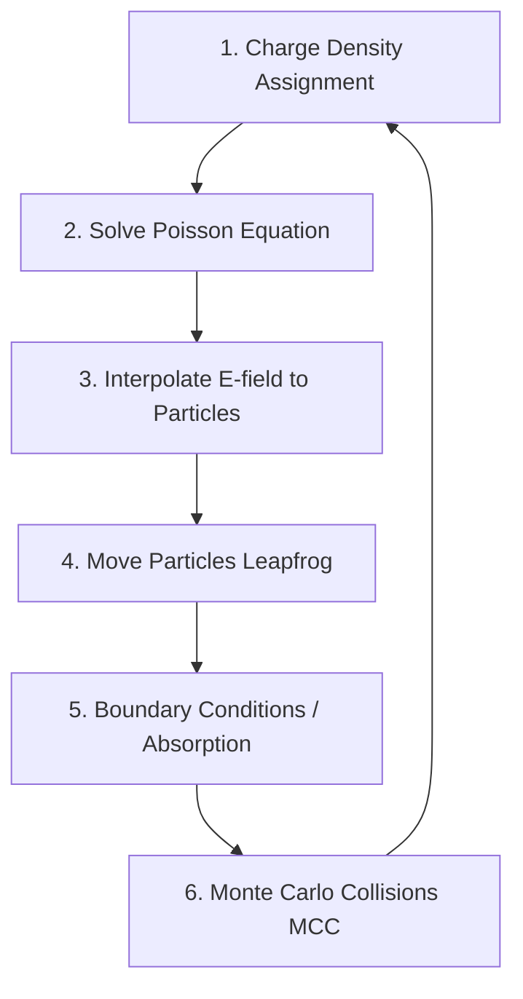

# eduPIC Assistant Custom Skill

This skill contains the structural, physical, and algorithmic details of the **eduPIC** 1D3V particle-in-cell radio-frequency plasma simulation to assist in translating, refactoring, or extending the codebase.

---

## 🔬 Physics & Constants Reference

The simulation models a Capacitively Coupled Plasma (CCP) in **Argon (Ar)** gas between two parallel plate electrodes with gap $L = 25\text{ mm}$ and fictive area $A = 1\text{ cm}^2$ ($1.0 \times 10^{-4}\text{ m}^2$).

### 1. Fundamental Constants
* `PI` = $3.141592653589793$
* `E_CHARGE` = $1.60217662 \times 10^{-19}\text{ C}$
* `E_MASS` = $9.10938356 \times 10^{-31}\text{ kg}$ (Electron mass)
* `AR_MASS` = $6.63352090 \times 10^{-26}\text{ kg}$ (Argon atom mass)
* `MU_ARAR` = $\text{AR\_MASS} / 2.0$ (Reduced mass for ion-atom collision)
* `K_BOLTZMANN` = $1.38064852 \times 10^{-23}\text{ J/K}$
* `EPSILON0` = $8.85418781 \times 10^{-12}\text{ F/m}$

### 2. Default Run Parameters (Table 1)
* **Electrode Gap ($L$)**: $0.025\text{ m}$
* **Grid Points ($N_G$)**: $400$ ($\Delta x = L / (N_G - 1)$)
* **Driving Frequency ($f$)**: $13.56\text{ MHz}$ ($\omega = 2\pi f$)
* **Voltage Amplitude ($V_0$)**: $250.0\text{ V}$
* **Ar Pressure ($p$)**: $10.0\text{ Pa}$
* **Gas Temperature ($T_g$)**: $350.0\text{ K}$
* **Gas Density ($n_g$)**: $p / (k_B T_g)$
* **Superparticle Weight ($W$)**: $7.0 \times 10^4$
* **Initial Superparticles ($N_{\text{init}}$)**: $1000$ electrons and $1000$ ions
* **RF Time Steps ($N_T$)**: $4000$ per RF cycle ($\Delta t_e = T / N_T$)
* **Ion Subcycling ($N_{\text{sub}}$)**: $20$ ($\Delta t_i = N_{\text{sub}} \Delta t_e$)

---

## 🔄 Algorithmic Loop (The PIC/MCC Cycle)

Every RF cycle has $N_T$ electron time steps. At step $t \in [0, N_T-1]$:

### Step 1: Density Deposition (Linear Weighting)
* Linearly deposit particle positions $x_p$ onto grid points $i$ and $i+1$:
  $$c_0 = x_p / \Delta x, \quad p = \lfloor c_0 \rfloor$$
  $$n_i \mathrel{+}= (p + 1 - c_0) \times \frac{W}{A \Delta x}$$
  $$n_{i+1} \mathrel{+}= (c_0 - p) \times \frac{W}{A \Delta x}$$
* **Boundary adjustment**: Outermost grid points ($0$ and $N_G-1$) represent half-size grid cells. Their deposited densities must be multiplied by $2.0$.
* **Subcycling**: Ions are only deposited and moved every $N_{\text{sub}}$ time steps ($t \bmod N_{\text{sub}} == 0$).

### Step 2: Solve Poisson Equation (Thomas Algorithm)
Solve the 1D tridiagonal system for the potential $\Phi$:
$$\frac{\partial^2 \Phi}{\partial x^2} = -\frac{e(n_i - n_e)}{\epsilon_0}$$
* **Boundary Conditions**:
  * Powered Electrode ($x = 0$): $\Phi(0) = V_0 \cos(\omega t)$
  * Grounded Electrode ($x = L$): $\Phi(L) = 0$
* **Electric Field**:
  * Central nodes: $E_i = \frac{\Phi_{i-1} - \Phi_{i+1}}{2 \Delta x}$
  * Powered boundary: $E_0 = \frac{\Phi_0 - \Phi_1}{\Delta x} - \frac{\rho_0 \Delta x}{2\epsilon_0}$
  * Grounded boundary: $E_{N_G-1} = \frac{\Phi_{N_G-2} - \Phi_{N_G-1}}{\Delta x} + \frac{\rho_{N_G-1} \Delta x}{2\epsilon_0}$

### Steps 3 & 4: Move Particles (Leapfrog Scheme)
* Interpolate electric field $E$ at particle position $x_p$:
  $$E(x_p) = (p + 1 - c_0) E_i + (c_0 - p) E_{i+1}$$
* Update velocity (half-step shift for leapfrog initialization is required):
  $$v^{new} = v^{old} \pm \frac{q E(x_p)}{m} \Delta t$$
* Update position:
  $$x^{new} = x^{old} + v^{new} \Delta t$$

### Step 5: Boundary Conditions (Absorption)
* If $x_p < 0$ or $x_p > L$:
  * Mark particle for removal.
  * Increment absorption counters (`N_e_abs_pow`, `N_e_abs_gnd`, etc.).
  * For ions, record arriving energy $0.5 m_i v^2$ into the Ion Flux Energy Distribution (`ifed_pow` / `ifed_gnd`).
* Remove particles from vectors by replacing the deleted index with the last active particle (fast $O(1)$ delete).

### Step 6: Monte Carlo Collisions (MCC)
Determine collision probability for each particle:
$$P_{\text{coll}} = 1 - e^{-\nu_{\text{tot}}(E) \Delta t}$$
Where macroscopic total cross section $\nu_{\text{tot}}(E) = \sigma_{\text{tot}}(E) \times n_g \times v$.
* **Null-Collision / Single-Particle Check**: Compare a random number $r \in [0, 1)$ to $P_{\text{coll}}$.
* If collision occurs, pick the specific process based on individual cross-section ratios.
* **Electron Collisions (with Argon)**:
  1. *Elastic*: Isotropic scattering.
  2. *Excitation*: Isotropic scattering, energy loss $E_{\text{exc\_th}} = 11.5\text{ eV}$.
  3. *Ionization*: Energy loss $E_{\text{ion\_th}} = 15.8\text{ eV}$. Create a new electron and ion at the collision position. Share remaining energy $E_{\text{remain}}$ between scattered and ejected electrons.
* **Ion Collisions (with Argon)**:
  * Sample a random target gas atom velocity from a Maxwell-Boltzmann distribution.
  * Calculate relative velocity.
  * Processes:
    1. *Isotropic Elastic*: Isotropic scattering in center-of-mass frame.
    2. *Backward Elastic*: Charge exchange (ion takes the neutral atom's velocity, scattering angle $\theta = \pi$).

---

## ⚠️ Stability & Accuracy Criteria

The code must check and report these stability conditions at the end of simulation:
1. **Debye Length**: $\Delta x / \lambda_D < 1.0$ (grid spacing resolves Debye sheath).
2. **Plasma Frequency**: $\omega_{pe} \Delta t_e < 0.2$ (electron time step resolves plasma oscillations).
3. **Collision Probability**: $P_{\text{coll}} < 0.05$ (prevent multiple collisions per time step).
4. **CFL Condition**: $v_{e,\text{max}} \Delta t_e < \Delta x$. Max electron energy allowed is $E_{\text{CFL}} = \frac{1}{2} m_e \left(\frac{\Delta x}{\Delta t_e}\right)^2$.

---

## 🚀 Translation & Implementation Guidelines

When translating or refactoring the code into Go or Python:

1. **Memory Allocation**:
   * Dynamic sizing is critical since particles are created and destroyed. In Go, use slices and keep a pool of structures, or use separate 1D slices for coordinates (`x`, `vx`, `vy`, `vz`) like the C++ code to maintain cache locality and allow vectorized/SIMD-like optimizations.
2. **Random Number Generation**:
   * Use an equivalent of `std::mt19937` with identical seeds/methods if strict binary reproducibility with the C version is required.
3. **Subcycling & Performance**:
   * The electron particle push loop (`do_one_cycle()`) is the main hot path. Ensure this is highly optimized, using contiguous memory slices and avoiding garbage collection overhead.
