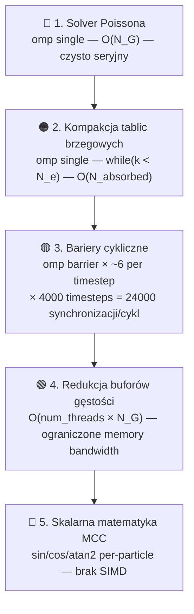

# 📊 Analiza Zrównoleglonej Implementacji OpenMP — eduPIC PIC/MCC

## Przegląd Projektu

Analiza obejmuje **9 plików źródłowych** implementacji 1D3V PIC/MCC (Particle-in-Cell / Monte Carlo Collisions) zrównoleglonej za pomocą OpenMP, znajdującej się w [`C/parallel-only-omp/`](file:///home/oliwier/Dev/GoPIC/C/parallel-only-omp).

---

## Szczegółowe Raporty Per-Plik

| # | Plik(i) | Raport |
|:--|:--------|:-------|
| 1 | `constants.h`, `state.h` | [analysis_constants_state.md](file:///home/oliwier/.gemini/antigravity-cli/brain/9e280a01-be05-4269-ab2a-5146d389e032/analysis_constants_state.md) |
| 2 | `simulation.h`, `eduPIC.cc` | [analysis_simulation_main.md](file:///home/oliwier/.gemini/antigravity-cli/brain/9e280a01-be05-4269-ab2a-5146d389e032/analysis_simulation_main.md) |
| 3 | `collisions.h`, `cross_sections.h`, `null_collision.h` | [analysis_collisions_cross_sections.md](file:///home/oliwier/.gemini/antigravity-cli/brain/9e280a01-be05-4269-ab2a-5146d389e032/analysis_collisions_cross_sections.md) |
| 4 | `poisson.h` | [analysis_poisson.md](file:///home/oliwier/.gemini/antigravity-cli/brain/9e280a01-be05-4269-ab2a-5146d389e032/analysis_poisson.md) |
| 5 | `io_manager.h`, `tests/*` | [analysis_io_tests.md](file:///home/oliwier/.gemini/antigravity-cli/brain/9e280a01-be05-4269-ab2a-5146d389e032/analysis_io_tests.md) |

---

## Mapa Optymalizacji

### 🔧 Optymalizacje OpenMP (Wielowątkowe)

| Optymalizacja | Plik | Opis | Źródło |
|:--------------|:-----|:-----|:-------|
| **Persistent Parallel Region** | `simulation.h` | Jednokrotne `#pragma omp parallel` wokół całej pętli N_T zamiast fork-join w każdym kroku | [LLNL OpenMP Tutorial](https://hpc-tutorials.llnl.gov/openmp/performance/#omp_overhead) |
| **Thread-Local Buffers** | `state.h`, `simulation.h` | `WorkerBuffers` — prealokowane lokalne tablice wątków dla density, diagnostyk | [OpenMP Spec 5.0](https://www.openmp.org/spec-html/5.0/openmpsu107.html) |
| **Thread-Local RNG** | `state.h` | `thread_local std::mt19937 MTgen` — per-thread Mersenne Twister | [cppreference](https://en.cppreference.com/w/cpp/keyword/thread_local) |
| **`nowait` clauses** | `simulation.h` | `#pragma omp for nowait` na niezależnych pętlach push/density | [OpenMP Spec](https://www.openmp.org/spec-html/5.0/openmpsu107.html) |
| **`#pragma omp single`** | `simulation.h` | Solver Poissona, losowanie Null Collision | [Wikipedia - Amdahl's Law](https://en.wikipedia.org/wiki/Amdahl%27s_law) |
| **`#pragma omp atomic`** | `simulation.h` | Low-contention atomics dla rzadkich zliczeń kolizji | [Intel OpenMP Performance](https://www.intel.com/content/www/us/en/developer/articles/technical/performance-insights-to-openmp-applications.html) |
| **`NewParticles` struct** | `collisions.h` | Thread-local bufory nowych cząstek (jonizacja) zamiast globalnego push_back | [OpenMP Spec 5.2](https://www.openmp.org/wp-content/uploads/OpenMP-API-Specification-5-2.pdf) |

### 💾 Optymalizacje Pamięciowe

| Optymalizacja | Plik | Opis | Źródło |
|:--------------|:-----|:-----|:-------|
| **SoA (Structure of Arrays)** | `state.h` | Oddzielne tablice `x_e[]`, `vx_e[]`, `vy_e[]`, `vz_e[]` zamiast AoS | [Intel Memory Layout](https://www.intel.com/content/www/us/en/developer/articles/technical/memory-layout-transformations.html) |
| **`alignas(64)` padding** | `state.h` | `AlignedThreadCounters` wyrównane do cache line (64B) | [Intel False Sharing](https://www.intel.com/content/www/us/en/developer/articles/technical/avoiding-and-identifying-false-sharing-among-threads.html) |
| **Zero-allocation main loop** | `state.h` | Prealokacja wszystkich buforów w `init_buffers()` przed pętlą | [LLNL OpenMP](https://hpc-tutorials.llnl.gov/openmp/performance/#omp_overhead) |
| **Inline functions** | `poisson.h`, `collisions.h` | `inline` eliminuje narzut stack frame w hot path | [GCC Inline Docs](https://gcc.gnu.org/onlinedocs/gcc/Inline.html) |
| **Block I/O** | `io_manager.h` | `fwrite()` tablicami zamiast per-element | Standard C |

### 🧮 Optymalizacje Algorytmiczne

| Optymalizacja | Plik | Opis | Źródło |
|:--------------|:-----|:-----|:-------|
| **Null Collision Method** | `null_collision.h` | Stałe $P^*$ zamiast per-particle `1-exp(...)` — przenosi branching poza pętlę | [Vahedi & Surendra 1995](https://doi.org/10.1016/0010-4655(94)00171-W) |
| **Cross-section LUT** | `cross_sections.h` | Pre-computed lookup tables ($10^6$ bins) zamiast `pow()` + `exp()` on-the-fly | [Intel Optimization Manual](https://www.intel.com/content/www/us/en/developer/articles/technical/intel-sdm.html) |
| **Branchless boundary handling** | `poisson.h` | Warunki brzegowe liczone poza pętlą (loop peeling) | [Intel Branch Prediction](https://www.intel.com/content/www/us/en/developer/articles/technical/intel-sdm.html) |
| **Flag-then-compact boundaries** | `simulation.h` | Równoległa faza flagowania + sekwencyjna kompakcja swap-and-pop | [Game Programming Patterns](https://gameprogrammingpatterns.com/data-locality.html) |

---

## ⚠️ Zidentyfikowane Zagrożenia

| Zagrożenie | Plik | Opis | Zalecenie |
|:-----------|:-----|:-----|:----------|
| 🔴 **Race Condition w `random_sample`** | `null_collision.h` | `static std::vector<int> pool` nie jest `thread_local` | Zmienić na `thread_local` lub przenieść do `WorkerBuffers` |
| 🟡 **`push_back` w hot path** | `collisions.h` | Dynamiczna alokacja w `NewParticles` wewnątrz MCC | Użyć `reserve(estimate)` opartego o $P^*$ |

---

## 🔻 Ranking Wąskich Gardeł (Bottlenecks)

### Analiza wpływu:

1. **Solver Poissona** — Sekwencyjny Thomas w `#pragma omp single`. Dla N_G=400 to ~mikrosekundy, ale przy strong scaling na 32+ rdzeni staje się dominującym ograniczeniem wg prawa Amdahla.

2. **Kompakcja tablic (Krok 5-6)** — Sekwencyjna defragmentacja swap-and-pop po równoległym flagowaniu. Koszt proporcjonalny do liczby zaabsorbowanych cząstek.

3. **Bariery synchronizacyjne** — ~6 jawnych `#pragma omp barrier` per timestep × 4000 timestepów/cykl = **24000 synchronizacji na cykl RF**. Każda bariera czeka na najwolniejszy wątek.

4. **Redukcja buforów** — Sumowanie thread-local tablic N_G do globalnych. Ograniczone przepustowością RAM (memory bandwidth bottleneck).

5. **Skalarna matematyka kolizji** — `sin()`, `cos()`, `atan2()` liczone per-particle bez wektoryzacji SIMD. Potencjał do `#pragma omp simd` + SVML.

---

## Podsumowanie

Implementacja stosuje **profesjonalne techniki HPC**: Persistent Parallel Region, SoA layout, `alignas(64)` anti-false-sharing, thread-local RNG, pre-allocated worker buffers, null collision method, i LUT cross-sections. Główne wąskie gardło to **inherentnie sekwencyjny solver Poissona** (Thomas algorithm) i **kompakcja tablic brzegowych** — oba zamknięte w `#pragma omp single`. Przy typowej liczbie rdzeni (4-16) wpływ jest minimalny, ale przy strong scaling na 32+ rdzeni stają się dominujące.
