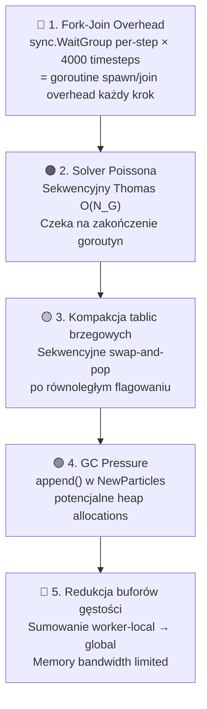

# 📊 Analiza Zrównoleglonej Implementacji Go (Parallel Chunking) — eduPIC PIC/MCC

## Przegląd Projektu

Analiza obejmuje **12 plików źródłowych Go** + testy implementacji 1D3V PIC/MCC zrównoleglonej za pomocą goroutyn z strategią podziału na chunki (strip mining), znajdującej się w [`Go/parallel_chunking/`](file:///home/oliwier/Dev/GoPIC/Go/parallel_chunking).

---

## Szczegółowe Raporty Per-Plik

| # | Plik(i) | Raport |
|:--|:--------|:-------|
| 1 | `constants.go`, `state.go` | [analysis_constants_state.md](file:///home/oliwier/Dev/GoPIC/Go_analysis/analysis_constants_state.md) |
| 2 | `simulation.go`, `simulation_null.go`, `simulation_standard.go` | [analysis_simulation.md](file:///home/oliwier/Dev/GoPIC/Go_analysis/analysis_simulation.md) |
| 3 | `collisions.go`, `cross_sections.go`, `poisson.go` | [analysis_collisions_poisson.md](file:///home/oliwier/Dev/GoPIC/Go_analysis/analysis_collisions_poisson.md) |
| 4 | `run.go`, `cmd/*`, `io_manager.go`, `go.mod` | [analysis_run_io.md](file:///home/oliwier/Dev/GoPIC/Go_analysis/analysis_run_io.md) |
| 5 | `tests/*` (9 plików) | [analysis_tests.md](file:///home/oliwier/Dev/GoPIC/Go_analysis/analysis_tests.md) |

---

## Architektura Równoległości: Go Chunking vs C/OMP

| Aspekt | C/OMP (`parallel-only-omp`) | Go (`parallel_chunking`) |
|:-------|:---------------------------|:-------------------------|
| **Model wątków** | `#pragma omp parallel` — persistent region | `sync.WaitGroup` + goroutiny — fork-join per-step |
| **Podział pracy** | `#pragma omp for schedule(static)` | Ręczny strip mining: `chunkSize = N/numWorkers` |
| **Synchronizacja** | `#pragma omp barrier`, `omp single` | `wg.Wait()`, sekwencyjne wywołania |
| **Thread-local storage** | `thread_local`, `alignas(64)` | Osobne `WorkerBuffers[workerID]` w slice'ach |
| **RNG** | `thread_local std::mt19937` | Per-worker `*rand.Rand` (seedowany `workerID`) |
| **Nowe cząstki (jonizacja)** | `NewParticles` struct + merge | `WorkerNewElectrons[workerID]` slice + append |
| **Null Collision** | `static pool` (potencjalny race!) | Build tag `nullcollision`, brak `static` — bezpieczne |
| **Kompilacja wariantów** | Brak (jeden kod) | Go build tags: `nullcollision` vs standard |

---

## Mapa Optymalizacji

### 🔧 Optymalizacje Równoległe (Goroutines)

| Optymalizacja | Plik | Opis | Źródło |
|:--------------|:-----|:-----|:-------|
| **Strip Mining (Chunking)** | `simulation.go` | Podział N cząstek na `numWorkers` ciągłych chunków — każda goroutyna operuje na `[start, end)` | [Strip Mining - Wikipedia](https://en.wikipedia.org/wiki/Loop_nest_optimization#Strip_mining) |
| **Worker-Local Buffers** | `state.go` | Pre-alokowane `WorkerBuffers[tid]` dla density, diagnostyk — zero lock contention | [Go Concurrency Patterns](https://go.dev/blog/pipelines) |
| **Per-Worker RNG** | `state.go` | Osobny `*rand.Rand` per goroutyna — eliminacja mutex na globalnym `rand` | [math/rand docs](https://pkg.go.dev/math/rand) |
| **sync.WaitGroup** | `simulation.go` | Lekka synchronizacja barrier-style zamiast kanałów — minimalne GC pressure | [sync.WaitGroup docs](https://pkg.go.dev/sync#WaitGroup) |
| **Build Tags (Null Collision)** | `simulation_null.go` | Wariant kompilacji `-tags nullcollision` — zero-cost abstraction w runtime | [Go Build Constraints](https://pkg.go.dev/go/build#hdr-Build_Constraints) |

### 💾 Optymalizacje Pamięciowe

| Optymalizacja | Plik | Opis | Źródło |
|:--------------|:-----|:-----|:-------|
| **SoA Layout (ParticleVector)** | `state.go` | `X_e[]`, `Vx_e[]`, `Vy_e[]`, `Vz_e[]` jako oddzielne slice'y — cache-friendly sequential access | [Intel SoA vs AoS](https://www.intel.com/content/www/us/en/developer/articles/technical/memory-layout-transformations.html) |
| **Pre-alokacja buforów** | `state.go` | `make([]float64, MAX_N_P)` w `NewSimulationState()` — zero alokacji w hot path | [Go Memory Model](https://go.dev/ref/mem) |
| **Escape Analysis minimization** | `state.go` | Struktury trzymane w slice'ach (stack-friendly) zamiast osobnych heap allocs | [Go Compiler Escape Analysis](https://go.dev/doc/faq#stack_or_heap) |
| **Swap-and-Pop deletion** | `simulation.go` | O(1) usuwanie cząstek zamiast O(N) przesuwania — zachowuje ciągłość pamięci | [Data Locality Pattern](https://gameprogrammingpatterns.com/data-locality.html) |

### 🧮 Optymalizacje Algorytmiczne

| Optymalizacja | Plik | Opis | Źródło |
|:--------------|:-----|:-----|:-------|
| **Null Collision Method** | `simulation_null.go` | Stałe $P^*$ — losowanie tylko ułamka cząstek zamiast sprawdzania wszystkich | [Vahedi & Surendra 1995](https://doi.org/10.1016/0010-4655(94)00171-W) |
| **Cross-section LUT** | `cross_sections.go` | Pre-computed lookup tables ($10^6$ bins) — O(1) zamiast kosztownych `math.Pow/Exp` | [Intel Optimization Manual](https://www.intel.com/content/www/us/en/developer/articles/technical/intel-sdm.html) |
| **Gaussian approximation** | `simulation_null.go` | Przybliżenie rozkładu dwumianowego rozkładem normalnym dla dużych N — szybsze niż binomialny sampling | [Normal Approximation to Binomial](https://en.wikipedia.org/wiki/Binomial_distribution#Normal_approximation) |
| **Block I/O** | `io_manager.go` | `binary.Write` tablicami zamiast per-element — redukcja syscalli | [encoding/binary docs](https://pkg.go.dev/encoding/binary) |

---

## 🧪 System Testów

| Test | Co weryfikuje | Metoda |
|:-----|:-------------|:-------|
| `parallel_push_test.go` | Bitowa identyczność push 1-thread vs N-threads | `GOMAXPROCS(1)` vs `GOMAXPROCS(4)`, `!=` porównanie |
| `parallel_density_test.go` | Spójność density scatter-add wielowątkowo | Relative tolerance `isCloseRel` (kolejność FP sumowania) |
| `null_collision_test.go` | Poprawność parametrów $P^*$, $\nu^*$ | Sprawdzenie `PStar < 0.05` + profilowanie energii |
| `regression_test.go` | End-to-end Golden Master | Kompilacja binarna + porównanie `conv.dat` z tolerancją 1e-12 |
| `poisson_test.go` | Solver w próżni i z ładunkiem | Liniowy profil potencjału, pochodna pola na brzegu |

---

## 🔻 Ranking Wąskich Gardeł (Bottlenecks)

### Porównanie z C/OMP:

| Bottleneck | C/OMP | Go Chunking |
|:-----------|:------|:------------|
| **Thread spawning** | ✅ Eliminated (Persistent Region) | 🔴 Per-step fork-join via WaitGroup |
| **Poisson solver** | 🔴 `omp single` | 🔴 Sekwencyjne wywołanie |
| **Boundary compaction** | 🟠 `omp single` | 🟠 Sekwencyjne |
| **GC pressure** | ✅ N/A (C++ manual memory) | 🟡 Go GC + append allocations |
| **Barrier overhead** | 🟠 ~24000 `omp barrier`/cycle | 🟠 ~24000 `wg.Wait()`/cycle |

> **Kluczowa różnica:** C/OMP używa **Persistent Parallel Region** (wątki żyją przez cały cykl), podczas gdy Go tworzy i synchronizuje goroutyny **per-step**. Przy 4000 timestepach i ~6 goroutine-launches per step, daje to ~24000 fork-join operacji na cykl RF — potencjalnie większy narzut niż bariery OMP.

---

## Podsumowanie

Implementacja Go stosuje **idiomatyczne wzorce Go**: `sync.WaitGroup` zamiast OMP barriers, per-worker slice'y zamiast `thread_local`, build tags zamiast #ifdef, oraz Golden Master regression testing. Główne optymalizacje algorytmiczne (Null Collision, LUT cross-sections, SoA layout) są identyczne jak w C/OMP. Kluczowa różnica architekturalna to brak persistent parallel region — goroutyny są tworzone per-step, co może powodować wyższy overhead na maszynach wielordzeniowych w porównaniu do C/OMP.
