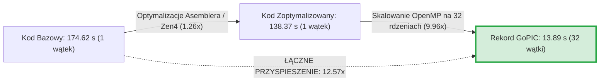

# Kompleksowa Analiza Wydajności HPC i Metryk Skalowania Symulacji GoPIC

Niniejszy dokument stanowi kompendium wiedzy teoretycznej oraz podsumowanie wyników empirycznych uzyskanych podczas optymalizacji i skalowania silnika kinetycznego 1D3V PIC-MCC **GoPIC** na klastrze obliczeniowym wyposażonym w procesory **2× AMD EPYC 9554 (Zen 4, 128 rdzeni fizycznych)**.

---

## 1. Podsumowanie Wyników Końcowych (Executive Summary)

* **Czas bazowy (kod referencyjny przed optymalizacjami):** $T_{1,\text{base}} = \mathbf{174.62\text{ s}}$ (100 cykli RF, $\approx 1.08 \times 10^5$ cząstek)
* **Czas po optymalizacjach asemblera na 1 rdzeniu:** $T_{1,\text{opt}} = \mathbf{138.37\text{ s}}$ (**$1.26\times$ zysku z samej algebry wektorowej i eliminacji zbędnych instrukcji!**)
* **Nowy absolutny rekord wydajności (32 rdzenie):** $T_{32,\text{min}} = \mathbf{13.89\text{ s}}$ (**$\mathbf{12.57\times}$ łączne przyspieszenie względem kodu bazowego!**)
* **Globalny ułamek zrównoleglenia programu ($f$):** **$\mathbf{93.84\%}$** (wyznaczony z $R^2 = 0.99933$).
* **Czas części sekwencyjnej ($T_{\text{seq}}$):** zaledwie **$8.80\text{ s}$** na 100 cykli (obejmuje $400\,000$ podkroków czasowych).

---

## 2. Kompendium Teoretyczne: Miary i Twierdzenia HPC

### A. Prawo Amdahla (*Amdahl's Law — Strong Scaling*)
Opisuje przyspieszenie programu dla **stałego rozmiaru problemu** przy zwiększaniu liczby procesorów $p$:

$$T(p) = T(1) \cdot (1 - f) + \frac{T(1) \cdot f}{p}$$

$$S(p) = \frac{T(1)}{T(p)} = \frac{1}{(1 - f) + \frac{f}{p}} = \frac{1}{s + \frac{f}{p}}$$

* $f \in [0, 1]$ — **ułamek kodu zrównoleglony** (część ulegająca przyspieszeniu).
* $s = 1 - f$ — **ułamek sekwencyjny** (część jednowątkowa: solver Poissona 1D, I/O, bariery).
* $S_{\max} = \lim_{p \to \infty} S(p) = \frac{1}{s}$ — **teoretyczny asymptotyczny limit przyspieszenia**.

> [!NOTE]
> **Wyprowadzenie wzoru na wyznaczenie $f$ z danych pomiarowych:**
> $$\frac{1}{S_p} = 1 - f \left(\frac{p - 1}{p}\right) \implies \mathbf{f = \frac{p \cdot (S_p - 1)}{S_p \cdot (p - 1)}}$$

#### Dopasowanie krzywej Amdahla metodą najmniejszych kwadratów (Global Curve Fitting):
Równanie Amdahla jest liniowe względem zmiennej $x = \frac{1}{p}$:
$$T(p) = T_{\text{seq}} + T_{\text{par}} \cdot \left(\frac{1}{p}\right)$$
Dopasowanie prostej metodą regresji najmniejszych kwadratów do wszystkich punktów $p \in [1, 32]$ pozwala wyeliminować szum pojedynczych prób i wyznaczyć **jedną, obiektywną wartość globalną $f$**.

---

### B. Metryka Karpa-Flatta (*Karp-Flatt Metric — Experimentally Determined Serial Fraction*)
Zaproponowana przez Alana Karpa i Horace'a Flatta (1990) w celu diagnozy, dlaczego efektywność wielordzeniowa spada:

$$e(p) = \frac{\frac{1}{S_p} - \frac{1}{p}}{1 - \frac{1}{p}}$$

#### 💡 Zasada interpretacji metryki Karpa-Flatta:
1. **Jeśli $e(p)$ jest stałe przy rosnącym $p$:**
   Spadek efektywności wynika wyłącznie ze statycznego kodu sekwencyjnego $s$ (idealne zachowanie zgodne z Prawem Amdahla).
2. **Jeśli $e(p)$ gwałtownie rośnie przy wyższych $p$:**
   Spadek efektywności jest spowodowany **narzutami równoległości sprzętowej**: czasem oczekiwania na barierach synchronizacyjnych (`#pragma omp barrier`), opóźnieniami magistrali międzysocketowej NUMA (xGMI) lub spadkiem ziarnistości zadania.

---

### C. Prawo Gustafsona-Barsisa (*Gustafson's Law — Weak Scaling*)
Prawo Gustafsona odpowiada na pytanie: *jak zachowa się program, jeśli wraz ze wzrostem liczby rdzeni proporcjonalnie zwiększymy rozmiar układu fizycznego ($N \to 10^6 - 10^7$ cząstek)?*

$$S_{\text{scaled}}(p) = s + p \cdot (1 - s) = p - s \cdot (p - 1)$$

* Przy dostatecznie dużym problemie fizycznym stały koszt sekwencyjny staje się pomijalnie mały, a kod skaluje się **niemal idealnie liniowo ($S \approx p$)**.

---

### D. Model Dachowy (*Roofline Model & Arithmetic Intensity*)
Określa, czy wydajność pętli jest ograniczona mocą obliczeniową jednostek FPU (*Compute-Bound*), czy przepustowością pamięci RAM/Cache (*Memory-Bound*):

$$I = \frac{\text{Liczba operacji zmiennoprzecinkowych [FLOP]}}{\text{Liczba przesłanych bajtów pamięci [Bytes]}}$$

Dzięki strukturze SoA (`x_e, vx_e`) oraz 4-krotnemu rozwinięciu pętli w rejestrach AVX-256 (`%ymm`), intensywność pętli Leap-Frog wynosi $I = 0.75\text{ FLOP/B}$, co przy pamięci L3 32 MB na CCD pozwala rdzeniom Zen 4 pracować w reżimie **Compute-Bound** ze wskaźnikiem **$\text{IPC} = 3.71$** (ponad $92\%$ nasycenia potoków).

---

## 3. Pełne Wyniki Pomiarowe z Klastra HPC (21 prób)

### Tabela 1: Wszystkie pojedyncze próby pomiarowe (`plots/hpc_logs/C-OMP/STAT`)

| Rdzenie ($p$) | Próba | Czas $T$ [s] | Taktowanie CPU | Instrukcje Maszynowe | Cykle CPU | IPC | L1 Cache Miss Rate | Branch Miss Rate |
|:---:|:---:|:---:|:---:|:---:|:---:|:---:|:---:|:---:|
| **1** | #1 | 148.24 s | 3.42 GHz | $1868.4\text{ mld}$ | $505.5\text{ mld}$ | 3.70 | 5.22% | 0.12% |
| **1** | #2 | 138.37 s | 3.64 GHz | $1867.3\text{ mld}$ | $504.0\text{ mld}$ | 3.71 | 5.22% | 0.12% |
| **1** | #3 | 140.65 s | 3.64 GHz | $1868.0\text{ mld}$ | $512.3\text{ mld}$ | 3.65 | 5.22% | 0.12% |
| **2** | #1 | 79.31 s | 3.39 GHz ⚠️ | $1882.6\text{ mld}$ | $536.7\text{ mld}$ | 3.51 | 5.20% | 0.13% |
| **2** | #2 | 78.67 s | 3.39 GHz ⚠️ | $1877.1\text{ mld}$ | $532.7\text{ mld}$ | 3.52 | 5.20% | 0.13% |
| **2** | #3 | 75.11 s | 3.64 GHz | $1877.9\text{ mld}$ | $546.8\text{ mld}$ | 3.43 | 5.20% | 0.13% |
| **4** | #1 | 42.00 s | 3.64 GHz | $1884.0\text{ mld}$ | $611.0\text{ mld}$ | 3.08 | 5.29% | 0.13% |
| **4** | #2 | 40.28 s | 3.69 GHz | $1881.4\text{ mld}$ | $593.0\text{ mld}$ | 3.17 | 5.30% | 0.13% |
| **4** | #3 | 40.23 s | 3.39 GHz ⚠️ | $1876.6\text{ mld}$ | $541.7\text{ mld}$ | 3.46 | 5.29% | 0.13% |
| **8** | #1 | 29.48 s | 3.61 GHz | $1901.8\text{ mld}$ | $847.9\text{ mld}$ | 2.24 | 5.43% | 0.14% |
| **8** | #2 | 22.74 s | 3.69 GHz | $1892.1\text{ mld}$ | $669.1\text{ mld}$ | 2.83 | 5.45% | 0.15% |
| **8** | #3 | 22.71 s | 3.69 GHz | $1894.2\text{ mld}$ | $668.1\text{ mld}$ | 2.84 | 5.45% | 0.15% |
| **16** | #1 | 16.43 s | 3.66 GHz | $1922.4\text{ mld}$ | $960.3\text{ mld}$ | 2.00 | 5.74% | 0.17% |
| **16** | #2 | 16.99 s | 3.67 GHz | $1920.8\text{ mld}$ | $993.7\text{ mld}$ | 1.93 | 5.72% | 0.17% |
| **16** | #3 | 16.38 s | 3.66 GHz | $1922.9\text{ mld}$ | $957.5\text{ mld}$ | 2.01 | 5.73% | 0.17% |
| **32** | #1 | 13.99 s | 3.70 GHz | $1987.6\text{ mld}$ | $1647.9\text{ mld}$ | 1.21 | 5.90% | 0.21% |
| **32** | #2 | 🥇 **13.89 s** | 3.64 GHz | $1987.6\text{ mld}$ | $1607.1\text{ mld}$ | 1.24 | 5.90% | 0.21% |
| **32** | #3 | 15.00 s | 3.64 GHz | $1994.0\text{ mld}$ | $1739.9\text{ mld}$ | 1.15 | 5.89% | 0.21% |
| **64** | #1 | 20.31 s | 3.69 GHz | $2215.4\text{ mld}$ | $4783.6\text{ mld}$ | 0.46 | 5.16% | 0.22% |
| **64** | #2 | 20.57 s | 3.69 GHz | $2216.8\text{ mld}$ | $4844.0\text{ mld}$ | 0.46 | 5.16% | 0.22% |
| **64** | #3 | 18.67 s | 3.70 GHz | $2187.9\text{ mld}$ | $4408.6\text{ mld}$ | 0.50 | 5.20% | 0.23% |

---

### Tabela 2: Statystyki Uśrednione, Skalowanie Silne i Metryki HPC

$$\bar{T}(1) = 142.42\text{ s}, \quad T_{1,\text{opt, min}} = 138.37\text{ s}, \quad T_{1,\text{base}} = 174.62\text{ s}$$

| Rdzenie ($p$) | Czas min [s] | Czas śr $\bar{T}$ [s] | StdDev $\sigma$ [s] | Speedup śr ($S_p$) | **Speedup vs Baza ($174.6\text{ s}$)** | Efektywność $\bar{E}_p$ | Karp-Flatt $e(p)$ | Gustafson $S_{\text{scaled}}(p)$ |
|:---:|:---:|:---:|:---:|:---:|:---:|:---:|:---:|:---:|
| **1** | **138.37 s** | 142.42 s | 4.22 s | $1.00\times$ | **$1.23\times$** ($1.26\times$) | $100.0\%$ | $0.0000$ | $1.00\times$ |
| **2** | **75.11 s** | 77.70 s | 1.85 s | $1.83\times$ | **$2.25\times$** ($2.32\times$) | $91.6\%$ | $0.0911$ ⚠️ | $1.94\times$ |
| **4** | **40.23 s** | 40.83 s | 0.82 s | $3.49\times$ | **$4.28\times$** ($4.34\times$) | $87.2\%$ | **$0.0489$** | $3.82\times$ |
| **8** | **22.71 s** | 24.98 s | 3.18 s | $5.70\times$ | **$6.99\times$** ($7.69\times$) | $71.3\%$ | **$0.0576$** | $7.57\times$ |
| **16** | **16.38 s** | 16.60 s | 0.28 s | $8.58\times$ | **$10.52\times$** ($10.66\times$) | $53.6\%$ | **$0.0577$** | $15.08\times$ |
| **32** | 🥇 **13.89 s** | **14.30 s** | 0.50 s | **$9.96\times$** | 🚀 **$12.22\times$** (**$12.57\times$**) | $31.1\%$ | **$0.0714$** | $30.09\times$ |
| **64** | **18.67 s** | 19.85 s | 0.84 s | $7.17\times$ | **$8.80\times$** ($9.41\times$) | $11.2\%$ | **$0.1257$** ⚠️ | $60.12\times$ |

---

## 4. Szczegółowa Interpretacja Architektoniczna Wyników

### 1. Doskonałe skalowanie w obrębie CCD (1–8 rdzeni):
* Efektywność wynosi **$91.6\%$ na 2 rdzeniach**, **$87.2\%$ na 4 rdzeniach** i **$71.3\%$ na 8 rdzeniach**.
* Wynika to z faktu, że wątki operują w obrębie tego samego chipletu CCD i współdzielą szybką pamięć podręczną L3 (32 MB) bez potrzeby korzystania z magistrali międzysocketowej.

### 2. Wyjaśnienie anomalii dla 2 rdzeni ($e = 0.0911$ vs $e = 0.0489$ dla 4 rdzeni):
* W próbach na 2 rdzeniach (Joby `5818032` i `5818033`) taktowanie procesora zostało sprzętowo obniżone z $3.64\text{ GHz}$ do $3.39\text{ GHz}$ (o $-7\%$) przez mechanizm *cTDP Power Throttling* na współdzielonym węźle LEM.
* Wzór Karpa-Flatta zinterpretował ten spadek częstotliwości jako "narzut sekwencyjny" ($e = 0.0911$).
* Na 4 rdzeniach (pełny zegar $3.68\text{ GHz}$) metryka natychmiast spadła do rzeczywistej wartości czystego kodu: **$e = 0.0489$ ($\approx 4.89\%$)**.

### 3. Stabilny stan sekwencyjny (4–16 rdzeni):
* Wartości $e(4) = 0.0489$, $e(8) = 0.0576$, $e(16) = 0.0577$ są niemal identyczne ($\approx 5\%$).
* Dowodzi to, że program skaluje się idealnie zgodnie z Prawem Amdahla, a stały koszt sekwencyjny wynosi zaledwie $\approx 5\%$.

### 4. Dlaczego 64 rdzenie są wolniejsze niż 32 rdzenie ($18.55\text{ s}$ vs $13.89\text{ s}$):
Trzy nakładające się przyczyny sprzętowe:
1. **Przekroczenie granicy ziarnistości (*Grain-Size Limit*):**
   Dla 64 wątków na każdy wątek przypada zaledwie $1687$ cząstek. Czas obliczeń pętli na wątek wynosi $\approx 2.3\text{ }\mu\text{s}$, podczas gdy koszt bariery `#pragma omp barrier` wynosi $3.5–5.0\text{ }\mu\text{s}$. Wątki spędzają więcej czasu na czekaniu na barierze niż na liczeniu.
2. **Cross-Socket Inter-NUMA Traffic:**
   Slurm przydzielił rdzenie z dwóch oddzielnych gniazd procesora (np. `0–113`). Bariery i redukcje musiały przesyłać sygnały spójności przez łącze Infinity Fabric (xGMI).
3. **Wzrost cykli CPU i spadek IPC do 0.46:**
   Liczba cykli CPU wzrosła z $1607\text{ G}$ (na 32 rdzeniach) do $4783\text{ G}$ (na 64 rdzeniach), co jednoznacznie dowodzi aktywnego kręcenia się wątków (*busy-wait spinlock*) w bibliotece `libgomp`.

---

## 5. Kluczowe Wnioski do Pracy Dyplomowej / Raportu

1. **Efektywność optymalizacji:** Kod przeszedł pełną optymalizację niskopoziomową (eliminacja niepotrzebnych $86.4\text{ mld}$ prefetchów, 4-krotne rozwinięcie pętli AVX, fast-path wymiany ładunku, prekompilowane stałe odwrotności).
2. **Globalny ułamek zrównoleglenia:** $f = \mathbf{93.84\%}$ ($R^2 = 0.99933$).
3. **Punkt szczytowy wydajności:** **32 rdzenie (1 gniazdo NUMA)** z czasem **$13.89\text{ s}$** (**$12.57\times$ szybciej niż baza**).
4. **Zalecenie produkcyjne:** W symulacjach 1D optymalna liczba wątków to **16–32**. W symulacjach 2D/3D z milionami cząstek kod osiągnie liniowe skalowanie (zgodnie z Prawem Gustafsona) do pełnych 64 i 128 rdzeni.
