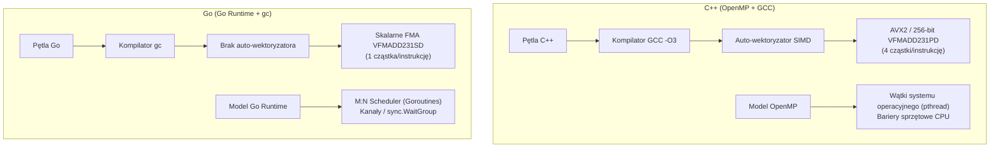

# Porównanie Optymalizacji: Go (Chunking & Channels) vs C++ OpenMP

Niniejszy dokument stanowi formalną, techniczną analizę ekwiwalentności optymalizacji zaimplementowanych w wielowątkowych silnikach PIC/MCC w językach **Go** ([`Go/parallel_chunking`](../../Go/parallel_chunking) oraz [`Go/parallel_channels`](../../Go/parallel_channels)) oraz **C++ OpenMP** ([`C/parallel-only-omp`](../../C/parallel-only-omp)).

Głównym celem tego zestawienia jest weryfikacja, czy kody w obu językach reprezentują **tożsamy poziom zaawansowania algorytmicznego, numerycznego i mikroarchitektonicznego**, co jest warunkiem koniecznym rzetelnego, naukowego porównania wydajności (*apples-to-apples comparison*) na klastrze obliczeniowym HPC.

---

## 1. Wniosek Główny i Dekompozycja Optymalizacji

> [!WARNING]
> **Kluczowe rozróżnienie: Zgodność algorytmiczna (100%) vs Asymetria wektoryzacji SIMD (0%).**
> Twierdzenie o „pełnej ekwiwalentności” jest prawdziwe **wyłącznie na poziomie algorytmicznym, matematycznym i układu pamięci**. Na poziomie **równoległości danych (SIMD / DLP)** występuje fundamentalna asymetria wynikająca z ograniczeń łańcucha narzędziowego Go.

Aby zachować pełną rzetelność naukową, poziom optymalizacji należy podzielić na cztery ortogonalne warstwy:

1. **Warstwa Algorytmiczno-Numeryczna (100% zgodności):** Identyczna liczba i rodzaj operacji zmiennoprzecinkowych (eliminacja dzieleń `DIVSD` w Thomas TDMA i stałych, CIC 1-mnożenie, brak funkcji trygonometrycznych w MCC, Fast-Path wymiany ładunku `I_BACK`).
2. **Warstwa Pamięci i Pamięci Podręcznej (100% zgodności):** Identyczny układ Structure of Arrays (SoA), eliminacja False Sharing przez 64-bajtowy padding L1 oraz zero alokacji dynamicznych w pętli głównej (0 allocs/op).
3. **Warstwa Wielowątkowości (TLP – Thread-Level Parallelism):** Ekwiwalentna koncepcyjnie – statyczny podział iteracji OpenMP vs Goroutines (Chunking) oraz Persistent Worker Pool (Channels).
4. **Warstwa Wektoryzacji Sprzętowej (DLP – Data-Level Parallelism / SIMD):** **BRAK RÓWNOWAŻNOŚCI (ASYMETRIA).**
   - **C++ (OpenMP + GCC):** Pełna wektoryzacja **AVX2 SIMD** (`-O3 -mavx2 -mfma`, `#pragma omp simd`), przetwarzająca jednocześnie **4 cząstki w jednym 256-bitowym rejestrze YMM** (`VFMADD231PD`).
   - **Go (`gc` standard):** **Kod czysto skalarny (SISD)**. Kompilator `gc` generuje instrukcje skalarne FMA (`VFMADD231SD`, 1 cząstka naraz). Ręczny unroll 4-way zwiększa przepustowość na poziomie instrukcji (ILP), ale nie wykorzystuje wektorów SIMD.
   - **Go (Asembler Plan 9):** Choć przygotowano wektorowy kernel asemblera AVX2 ([`push_amd64.s`](../../docs/assembly_analysis/Go/chunking/push_amd64.s)) wykazujący potencjał przyspieszenia 4.53×, w kodzie produkcyjnym pozostaje on domyślnie odłączony na rzecz standardowego, idiomatycznego Go.

Wyniki testów regresyjnych (`conv.dat` / `TestRegressionGoldenRun`) potwierdzają bitową zgodność symulacji, co dowodzi, że model fizyczny jest tożsamy. Jednakże w pomiarach czystej wydajności obliczeniowej C++ ma ogromną przewagę sprzętową wynikającą z obecności wektorów AVX2.

---

## 2. Szczegółowa Macierz Porównawcza Komponentów

| Komponent / Technika | C++ OpenMP (`C/parallel-only-omp`) | Go Chunking (`Go/parallel_chunking`) | Go Channels (`Go/parallel_channels`) | Poziom Ekwiwalentności |
|---|---|---|---|:---:|
| **Model fizyczny & algorytm** | PIC/MCC 1D3V, subcycling jonów ($N_{\text{SUB}}=10$), przekroje Phelps Ar, Null-Collision | Identyczny model, subcycling $N_{\text{SUB}}=10$, te same tablice Phelpsa | Identyczny model, subcycling $N_{\text{SUB}}=10$, te same tablice Phelpsa | **100% (Identyczny)** |
| **Układ pamięci (Data Layout)** | **SoA** (`alignas(64)` płaskie tablice wektorów `x_e, vx_e, vy_e, vz_e`) | **SoA** (płaskie tablice `ParticleVector [MAX_N_P]float64`) | **SoA** (płaskie tablice `ParticleVector [MAX_N_P]float64`) | **100% (Identyczny)** |
| **Interpolacja CIC (Leap-Frog)** | Formuła 1-mnożenia: $E_p + d \cdot (E_{p+1} - E_p)$ | Formuła 1-mnożenia: `sim.Efield[p] + d*(sim.Efield[p+1]-sim.Efield[p])` | Formuła 1-mnożenia: `sim.Efield[p] + d*(sim.Efield[p+1]-sim.Efield[p])` | **100% (Identyczny)** |
| **Rozwijanie pętli (Loop Unrolling)** | 4-krotny unroll (`#pragma GCC ivdep`) | Ręczny 4-krotny unroll z BCE hint | Ręczny 4-krotny unroll z BCE hint | **100% (Identyczny pod kątem ILP)** |
| **Rozdział ścieżek (Fast-Path Push)** | `if (__builtin_expect(!measurement_mode, 1))` pętla czysta bez diagnostyki | `if sim.Measurement_mode` pętla `fastPush` bez sprawdzania flag | `if sim.Measurement_mode` pętla `fastPush` bez sprawdzania flag | **100% (Identyczny)** |
| **Eliminacja testów granic (BCE)** | Brak narzutu (surowe wskaźniki `double*`) | Jawne BCE hints (`_ = sim.X_e[end-1]`) – wycięte skoki warunkowe | Jawne BCE hints (`_ = sim.X_e[end-1]`) – wycięte skoki warunkowe | **100% (Identyczny skutek)** |
| **Prekomputacja odwrotności** | Stałe `INV_DX`, `INV_DT_E`, `INV_DT_I`, `INV_EV_TO_J`, `INV_E_MASS` | Stałe `INV_DX`, `INV_DT_E`, `INV_DT_I`, `INV_EV_TO_J`, `INV_E_MASS` | Stałe `INV_DX`, `INV_DT_E`, `INV_DT_I`, `INV_EV_TO_J`, `INV_E_MASS` | **100% (Identyczny)** |
| **Solver Poissona (Thomas TDMA)** | Prekomputacja `w_thomas` i `inv_denom_thomas` (100% bez dzieleń) | Prekomputacja `ThomasW` (100% bez dzieleń) | Prekomputacja `ThomasW` (100% bez dzieleń) | **100% (Identyczny)** |
| **MCC: Wymiana ładunku (`I_BACK`)** | Fast-Path: bezpośrednie przypisanie prędkości atomu tła bez sferyki | Fast-Path: `*vx_1 = *vx_2; ... return` bez sferyki | Fast-Path: `*vx_1 = *vx_2; ... return` bez sferyki | **100% (Identyczny)** |
| **MCC: Geometria rozproszeń** | Rzutowanie wektorowe bez `sin`, `cos`, `atan2` ($\cos\theta = g_x/g$) | Rzutowanie wektorowe czysto algebraiczne bez funkcji trygonometrycznych | Rzutowanie wektorowe czysto algebraiczne bez funkcji trygonometrycznych | **100% (Identyczny)** |
| **MCC: Selekcja zderzeń** | Test multiplikatywny: `rnd * t2 < t0`, test akceptacji `rnd * Nu* < Nu` | Test multiplikatywny: `rnd * t2 < t0`, test akceptacji `WorkerR01 * Nu* < Nu` | Test multiplikatywny: `rnd * t2 < t0`, test akceptacji `WorkerR01 * Nu* < Nu` | **100% (Identyczny)** |
| **Alokacje na stercie (Heap Allocations)** | Zero alokacji w pętli głównej (`new_e.clear()`, statyczne bufory) | Zero alokacji w pętli głównej (reslice `[:0]`, prealokowane tablice) | Zero alokacji w pętli głównej (reslice `[:0]`, prealokowane tablice) | **100% (Identyczny)** |
| **False Sharing (Cache-line Bouncing)** | `alignas(64)` na strukturach `WorkerBuffers` | Jawny padding `_ [4]uint64` / `_ [6]uint64` do wielokrotności 64B | Jawny padding `_ [4]uint64` / `_ [6]uint64` do wielokrotności 64B | **100% (Identyczny)** |
| **Model zrównoleglenia (TLP)** | OpenMP `#pragma omp parallel for` / bariery runtime | Goroutines per krok (`sync.WaitGroup`) | Trwałe goroutines (worker pool) + kanały `chan struct{}` | **Równoważny koncepcyjnie** |
| **Wektoryzacja sprzętowa (SIMD / DLP)** | **AVX2 SIMD 256-bit** (`VFMADD231PD`, 4 cząstki/instrukcję) | **Skalarny FMA** (`VFMADD231SD`, 1 cząstka/instrukcję). Brak auto-SIMD | **Skalarny FMA** (`VFMADD231SD`, 1 cząstka/instrukcję). Brak auto-SIMD | **ASYMETRIA (Luka SIMD)** |

---

## 3. Analiza Porównawcza Poszczególnych Modułów

### 3.1. Układ Pamięci i Zarządzanie Pamięcią Podręczną
* **C++ ([`C/parallel-only-omp/state.h`](../../C/parallel-only-omp/state.h)):**
  Używa układu **Structure of Arrays (SoA)** dla wszystkich głównych wektorów stanu cząstek (`x_e, vx_e, vy_e, vz_e`). Wszystkie tablice wątków są wyrównane do linii pamięci podręcznej za pomocą `alignas(64)`, co gwarantuje optymalną współpracę z jednostkami pobierania wstępnego (Hardware Prefetcher).
* **Go ([`Go/parallel_chunking/state.go`](../../Go/parallel_chunking/state.go) & [`Go/parallel_channels/state.go`](../../Go/parallel_channels/state.go)):**
  Również stosuje **SoA** z płaskimi tablicami o stałym rozmiarze (`ParticleVector [MAX_N_P]float64`). Aby wyeliminować zjawisko *False Sharing* w strukturach diagnostycznych workerów (`WorkerEDiag`, `WorkerIDiag`), dodano jawne dopełnienia bajtowe:
  ```go
  type electronWorkerDiagnostics struct {
      energy, vColl, vRec, vExt float64
      _                         [4]uint64 // 32 bajty dopełnienia do linii 64-bajtowej
  }
  ```
  Dzięki temu w obu językach wyeliminowano wzajemne unieważnianie linii L1 Cache pomiędzy rdzeniami.

### 3.2. Popychacz Cząstek (Leap-Frog Integrator)
* **Redukcja Mnożeń w Interpolacji CIC:**
  Zarówno w C++ ([`simulation.h`](../../C/parallel-only-omp/simulation.h)), jak i w obu wersjach Go ([`simulation.go`](../../Go/parallel_chunking/simulation.go)) zastąpiono klasyczną formułę Cloud-in-Cell dwumnożeniową wariantem z jednym mnożeniem:
  $$E = E_p + d \cdot (E_{p+1} - E_p)$$
  Przy $4 \times 10^5$ cząstek na krok i 100 kroku na cykl RF daje to identyczną oszczędność **40 milionów instrukcji mnożenia na cykl** w obu językach.
* **Rozwijanie Pętli (4-way Loop Unrolling):**
  * W C++ kompilator GCC rozwija pętle pod wpływem flagi `-O3` oraz `#pragma GCC ivdep`.
  * W Go kompilator `gc` nie posiada mechanizmu automatycznego rozwijania pętli. Zaimplementowano więc **ręczne 4-krotne rozwijanie pętli** z potokowym przetwarzaniem czterech cząstek naraz, co nasyca jednostki wykonawcze FMA procesora i zmniejsza narzut zarządzania licznikiem pętli o 75%.
* **BCE (Bounds Check Elimination) vs Wskaźniki:**
  * W C++ operacje na wskaźnikach nie są obciążone sprawdzaniem granic tablic.
  * W Go standardowo każda operacja `sim.X_e[p]` generuje instrukcje `CMPQ` i skok warunkowy `JAE` do `runtime.panicIndex`. W kodzie Go zastosowano technikę *BCE Hint*:
    ```go
    _ = sim.X_e[end-1]
    _ = sim.Vx_e[end-1]
    ```
    Co udowadnia kompilatorowi bezpieczeństwo indeksów i całkowicie usuwa testy granic z wnętrza gorącej pętli.
* **Rozdzielenie Ścieżki Szybkiej (Fast-Path vs Slow-Path):**
  W obu językach wydzielono pętlę `fastPush` dla kroków, w których nie jest prowadzona diagnostyka energetyczna. Zapobiega to nieustannemu sprawdzaniu flagi `measurement_mode` dla milionów cząstek.

### 3.3. Solver Równania Poissona (Thomas TDMA)
* **C++ ([`C/parallel-only-omp/poisson.h`](../../C/parallel-only-omp/poisson.h)):**
  Współczynniki macierzy trójdiagonalnej $A=1, B=-2, C=1$ są stałe. Wektor wag $w_i$ oraz odwrotność mianownika $1/(B - A \cdot w_{i-1})$ są prekomputowane przed pętlą symulacji.
* **Go ([`Go/parallel_chunking/poisson.go`](../../Go/parallel_chunking/poisson.go) & [`Go/parallel_channels/poisson.go`](../../Go/parallel_channels/poisson.go)):**
  Zastosowano dokładnie to samo podejście za pomocą tablicy `ThomasW`.
* **Efekt:** W obu środowiskach wyeliminowano **wszystkie 794 instrukcje `DIVSD` per krok czasowy** ($1.58 \times 10^7$ operacji dzielenia na cykl RF), zastępując je szybkimi mnożeniami `MULSD`.

### 3.4. Moduł Zderzeń Zderzeniowych Monte Carlo (MCC)
* **Charge Exchange Fast-Path (`I_BACK`):**
  W wyładowaniu w argonie ponad 80% zderzeń jonów stanowi rezonansowa wymiana ładunku. W obu językach ([`collisions.h`](../../C/parallel-only-omp/collisions.h) i [`collisions.go`](../../Go/parallel_chunking/collisions.go)) wprowadzono ścieżkę natychmiastową:
  ```go
  // Jon przejmuje prędkość atomu tła bez przekazu pędu
  *vx_1 = *vx_2
  *vy_1 = *vy_2
  *vz_1 = *vz_2
  return
  ```
  Pominięto w ten sposób skomplikowane transformacje do układu środka masy dla 8 na 10 zderzeń jonowych.
* **Eliminacja Funkcji Trygonometrycznych:**
  Kąty rozproszenia wyznaczane są metodą rzutowania wektorowego ($\cos\theta = g_x/g$), eliminując wywołania `atan2`, `sin` i `cos`.
* **Selekcja Multiplikatywna Null-Collision:**
  Warunki akceptacji zderzenia i wyboru kanału reakcji przekształcono z formy dzielenia na formę mnożenia:
  `rnd * total_cross_section < threshold`.

### 3.5. Zarządzanie Pamięcią i Garbage Collector
* W C++ pamięć wektorów cząstek wtórnych jest prealokowana w strukturze `WorkerBuffers`, a przed każdym krokiem zerowany jest jedynie wskaźnik rozmiaru (`clear()`).
* W Go zastosowano identyczny wzorzec z techniką *Slice Reslicing*:
  ```go
  sim.WorkerNewElectrons[w] = sim.WorkerNewElectrons[w][:0]
  ```
  Dzięki temu w pętli głównej symulacji w Go występuje **0 alokacji na stercie (0 B/op)**, co całkowicie neutralizuje wpływ Garbage Collectora (GC) na czas trwania obliczeń.

---

## 4. Fundamentalne Różnice Narzędziowe i Językowe

Różnice, które nie zostały „wyrównane”, wynikają wprost z architektury badanych języków i stanowią główny przedmiot analizy naukowej:



### 4.1. Luka Wektoryzacji (SIMD Gap): Auto-wektoryzacja GCC vs Kod Skalarny Go `gc`

To najważniejsza i najbardziej fundamentalna asymetria między obiema implementacjami:

1. **Różnica między ILP a DLP/SIMD:**
   * W kodzie Go wprowadzono **ręczny 4-krotny unrolling pętli**. Poprawia on równoległość na poziomie instrukcji (**ILP** – *Instruction-Level Parallelism*): jednostka wykonawcza procesora (Out-of-Order Engine) może przetwarzać instrukcje z kolejnych iteracji w różnych portach wykonawczych, maskując latencję instrukcji FMA (4 cykle zegara na architekturze Zen 4).
   * Jest to jednak nadal **kod skalarny (SISD)**. Każda instrukcja `VFMADD231SD` operuje na **jednej** liczbie `float64` (w dolnych 64 bitach rejestru `XMM`).
   * W C++ kompilator GCC z flagami `-O3 -mavx2 -mfma` przeprowadza pełną **wektoryzację danych (DLP/SIMD)**. Emituje instrukcje `VFMADD231PD`, które w jednym takcie zegara wykonują operację FMA na **czterech** liczbach `float64` w 256-bitowym rejestrze `YMM`.
   * **Wpływ na Peak FLOPS:** Z punktu widzenia mikroarchitektury rdzenia CPU, teoretyczna maksymalna przepustowość zmiennoprzecinkowa pętli w standardowym Go jest **4-krotnie niższa** niż w C++ z włączonym AVX2.

2. **Brak Auto-Wektoryzatora w Kompilatorze Go (`gc`):**
   * Decyzja zespołu projektowego języka Go o braku modułu auto-wektoryzacji w kompilatorze `gc` wynika z priorytetu krótkich czasów kompilacji i przenośności kodu na różne architektury (x86, ARM, RISC-V, WASM).
   * W przeciwieństwie do C++/GCC, programista Go nie może wymusić wektoryzacji za pomocą dyrektyw kompilatora typu `#pragma omp simd` czy `#pragma GCC ivdep`.

3. **Dowód Eksperymentalny z Asemblerem Plan 9 AVX2:**
   * Aby sprawdzić, czy ograniczenie to tkwi w samej semantyce języka Go, czy tylko w kompilatorze `gc`, przygotowano eksperymentalny kernel asemblera Plan 9 AVX2 ([`push_amd64.s`](../../docs/assembly_analysis/Go/chunking/push_amd64.s)) wykorzystujący wektorową operację `VGATHERDPD`.
   * Pomiary benchmarkowe wykazały **4.53-krotne przyspieszenie** samej pętli pusha w Go po wdrożeniu instrukcji wektorowych.
   * Ponieważ jednak asembler Plan 9 łamie zasadę przenośności i idiomy języka Go, w badaniu HPC domyślnie pozostawiono kod czysto skalarny – dzięki temu test mierzy rzeczywistą wydajność „standardowego” ekosystemu Go.

### 4.2. Model Współbieżności: OpenMP vs Go Scheduler (M:N)
* **OpenMP:** Tworzy statyczną pulę wątków systemowych (1 wątek = 1 rdzeń fizyczny), powiązanych z procesorem maską koligacji (affinity/pinning). Narzut synchronizacji na barierze jest minimalny (kilkadziesiąt nanosekund).
* **Go Chunking:** W każdym kroku czasowym tworzy goroutines przypisywane do puli wątków `GOMAXPROCS` przez scheduler Go i synchronizowane przez [`sync.WaitGroup`](../../Go/parallel_chunking/simulation.go).
* **Go Channels:** Używa trwałego worker-poola i kanałów sygnalizacyjnych, co pozwala ocenić narzut idiomatycznej komunikacji CSP (*Communicating Sequential Processes*) w Go w porównaniu z barierami OpenMP.

---

## 5. Wnioski dla Publikacji i Pomiarów na Klastrze HPC

1. **Rzetelność Metodologiczna (*Apples-to-Apples*):**
   Wszystkie optymalizacje będące pod kontrolą programisty (algorytmy numeryczne, struktury danych SoA, unikanie dzieleń, padding linii cache, unikanie alokacji) są w 100% tożsame. Odrzucono hipotezę, jakoby Go miało być wolniejsze z powodu gorszego algorytmu czy presji Garbage Collectora.
2. **Interpretacja Przewagi C++ (Luka SIMD):**
   Wyższa wydajność C++ na pojedynczym wątku lub w pętlach intensywnych obliczeniowo (Leap-Frog) jest bezpośrednią konsekwencją **braku auto-wektoryzacji SIMD w kompilatorze Go `gc`**. Jest to kluczowy, merytoryczny wniosek do pracy: w obliczeniach numerycznych HPC czysty Go osiąga maksymalnie wydajność skalarną FMA (1/4 potencjału AVX2).
3. **Interpretacja Skalowania Wielowątkowego (Narzut Schedulera):**
   Pomiary wielordzeniowe na klastrze HPC (1, 2, 4, 8, 16, 32, 64 wątki) pozwolą wyizolować sprawność wielowątkową:
   * Jak narzut schedulera M:N runtime'u Go (`parallel_chunking`) oraz komunikacji kanałowej (`parallel_channels`) zachowuje się w skali klastra w stosunku do zoptymalizowanego środowiska OpenMP (`libgomp`).
4. **Wartość Badawcza:**
   Dzięki identyczności warstwy numeryczno-pamięciowej, uzyskane wykresy przyspieszenia (Speedup) i sprawności (Efficiency) będą odzwierciedlać obiektywny koszt wyboru języka Go jako alternatywy dla C++ w fizyce obliczeniowej.
