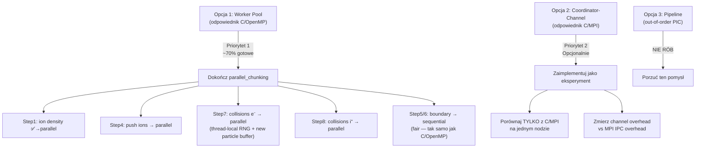

# Krytyczna Analiza Trzech Podejść do Zrównoleglenia PIC w Go

## Stan Obecny — Co Już Masz

| Język | Wariant 1 (Shared Memory) | Wariant 2 (Hybrid/Distributed) |
|:------|:--------------------------|:-------------------------------|
| **C** | [parallel-only-omp](file:///home/oliwier/Dev/GoPIC/C/parallel-only-omp/simulation.h) — OpenMP `#pragma omp parallel for` | [parallel-hybrid](file:///home/oliwier/Dev/GoPIC/C/parallel-hybrid/simulation.h) — OpenMP + MPI |
| **Python** | [numba_parallel](file:///home/oliwier/Dev/GoPIC/python/numba_parallel/simulation.py) — `numba.prange` | [hybrid_parallel](file:///home/oliwier/Dev/GoPIC/python/hybrid_parallel/simulation.py) — `mpi4py` + Numba |
| **Go** | [parallel_chunking](file:///home/oliwier/Dev/GoPIC/Go/parallel_chunking/simulation.go) — `sync.WaitGroup` + chunking (**częściowo zaimplementowane**) | ❌ brak |

---

## Twoje Trzy Propozycje Go

Z plików w [docs/go_parallel](file:///home/oliwier/Dev/GoPIC/docs/go_parallel) wynikają trzy warianty:

1. **Opcja 1: Chunking & Worker Pool** — odpowiednik OpenMP
2. **Opcja 2: Coordinator-Channel** — odpowiednik MPI (ale w jednym procesie)
3. **Opcja 3: Pipeline Parallelism** — asynchroniczny out-of-order PIC

---

## 🟢 Opcja 1: Chunking & Worker Pool — **TAK, to ma sens**

### Co to robi
Podział tablic cząstek na `GOMAXPROCS` chunków, goroutyna per chunk, `sync.WaitGroup` jako bariera, lokalne tablice gęstości + redukcja sekwencyjna.

### Krytyczna ocena

**Mocne strony:**
- ✅ **Bezpośredni odpowiednik C/OpenMP** — daje rzetelną bazę porównawczą
- ✅ **Już częściowo zaimplementowane** — Step1 (e-density) i Step3 (push electrons) działają w [parallel_chunking](file:///home/oliwier/Dev/GoPIC/Go/parallel_chunking/simulation.go)
- ✅ **Prosta architektura** — łatwe do debugowania i walidacji fizycznej
- ✅ **Mierzy dokładnie to, co chcesz** — narzut Go runtime scheduler vs OpenMP thread pool
- ✅ **Minimalne zmiany algorytmu** — identyczny algorytm jak w sekwencyjnej wersji

**Słabe strony / Ryzyka:**
- ⚠️ **Narzut goroutyn per time step**: Tworzysz `numWorkers` goroutyn × ~5 kroków × 4000 time steps = **~80 000 goroutyn na cykl**. W C++ OpenMP wątek jest tworzony raz (persistent parallel region). W Go nie masz persistent goroutine pool — musisz je tworzyć za każdym razem.

> [!TIP]
> **Optymalizacja**: Zamiast `wg.Go(func(){...})` w każdym kroku, stwórz **persistent worker pool** uruchamiany raz przy starcie symulacji. Workerzy czekają na `chan struct{}` (sygnał startu) i raportują zakończenie przez `sync.WaitGroup`. To eliminuje ~80k alokacji goroutyn per cykl.

- ⚠️ **Step4 (push ions) i Step1 (ion density) nadal sekwencyjne** — w Twojej implementacji tylko electron density i electron push są zrównoleglone, a reszta jest sekwencyjna. Trzeba to dokończyć.
- ⚠️ **Boundary + Collisions nadal sekwencyjne** — ale to identycznie jak w C/OpenMP, więc porównanie jest fair

### Wartość naukowa
**Wysoka** — pozwala bezpośrednio odpowiedzieć na pytanie:

> *Jak narzut Go runtime scheduler (model G-M-P, work stealing) wypada w porównaniu do OpenMP compiler-level threading w obliczeniach particle-intensive?*

---

## 🟡 Opcja 2: Coordinator-Channel — **Sens ma, ale z zastrzeżeniami**

### Co to robi
Jeden Koordynator (odpowiednik MPI rank 0) + N Pracowników komunikujących się przez kanały Go. Pracownicy nie mają dostępu do wspólnej pamięci siatki — wysyłają lokalne gęstości kanałem, otrzymują E-field kanałem.

### Krytyczna ocena

**Mocne strony:**
- ✅ **Odpowiednik MPI w jednym procesie** — pokazuje wydajność CSP (Communicating Sequential Processes) vs MPI
- ✅ **Idiomatyczne Go** — "Don't communicate by sharing memory; share memory by communicating"
- ✅ **Unikalne porównanie** — nikt (o ile mi wiadomo) nie robił takiego benchmarku CSP-channels vs MPI dla PIC

**Fundamentalne problemy:**

- 🔴 **Porównanie jest nierówne**: Twój C/MPI hybrid działa **między procesami** (potencjalnie między maszynami), a Go channel version działa **wewnątrz jednego procesu**. To porównanie jabłek do pomarańczy:
  - MPI na jednym nodzie = shared memory (via `MPI_Allreduce` z `MPI_IN_PLACE`) — ale z overhead IPC
  - Go channels = kopiowanie danych przez kanał w pamięci współdzielonej — ale z overhead schedulera

> [!IMPORTANT]
> Żeby porównanie było sensowne, musisz uruchamiać C/MPI **na jednym węźle** (nie rozproszonym klastrze) z tą samą liczbą "procesów" co goroutyn. Wtedy mierzysz: **MPI overhead (IPC, serializacja) vs Go channel overhead (scheduling, kopiowanie)**.

- 🔴 **Kopiowanie danych jest kosztowne**: W każdym time stepie kopiujesz:
  - N Pracowników × `[400]float64` gęstości → Koordynator (wysyłka)
  - Koordynator → N Pracowników × `[400]float64` E-field (broadcast)
  - To ~6400 bajtów × 2 × N_workers × 4000 time steps per cykl = **~200 MB kopiowania per cykl** (przy 8 workerach)
  - W Opcji 1 (shared memory) ten koszt wynosi 0 — workerzy czytają `sim.Efield[]` bezpośrednio

- 🔴 **Boundary redistribution jest koszmarem**: Po absorpcji cząstek trzeba je „redystrybuować" między Pracownikami. W MPI robisz `Allgatherv`. W Go channels musisz sam zaimplementować ten protokół. To dużo kodu, dużo okazji do bugów, i prawdopodobnie **wolniej** niż MPI (bo MPI jest zoptymalizowane pod latency).

- ⚠️ **Garbage Collector pressure**: Każdy `chan []float64` alokuje nowy slice na stercie. GC Go musi to zbierać. Przy 4000 time steps × N kanałów to ~80k alokacji per cykl. Ryzyko GC pauz w trakcie obliczeń.

### Wartość naukowa
**Umiarkowana, ale z interesującą tezą** — pod warunkiem, że:
1. Porównujesz z MPI **na jednym nodzie** (nie multi-node)
2. Jasno artikułujesz, że mierzysz *channel overhead* vs *MPI IPC overhead*
3. Wyeliminujesz GC noise (np. `runtime.GC()` + `GOGC=off` w krytycznej sekcji)

---

## 🔴 Opcja 3: Pipeline Parallelism (Out-of-Order PIC) — **Nie rób tego**

### Co to robi
Każdy krok PIC (Deposition, Poisson, Push, Boundary, Collisions) to osobna goroutyna-stage. Dane przepływają strumieniowo przez buforowane kanały. "Lekko opóźnione" pole E z kroku $t-1$ używane w push kroku $t+1$.

### Krytyczna ocena — dlaczego to nie zadziała

**Problem fundamentalny #1: Algorytm PIC jest ściśle sekwencyjny wewnątrz jednego time stepu**

```
Deposition(t) → Poisson(t) → Push(t) → Boundary(t) → Collisions(t) → Deposition(t+1)
```

Każdy krok **wymaga** wyniku poprzedniego. Nie ma data-level parallelism między stage'ami jednego time stepu. Pipeline depth = 1 → **zero zysku**.

**Problem fundamentalny #2: Out-of-order PIC narusza fizykę**

Twoja propozycja mówi: "Push kroku $t+1$ używa E-field z kroku $t-1$". To jest:
- ❌ **Naruszenie leapfrog scheme** — leapfrog jest symplektycznym integratorem O(2). Użycie opóźnionego pola E degraduje go do metody Eulera O(1), co:
  - Łamie zachowanie energii w systemie (leapfrog zachowuje Hamiltonian, Euler nie)
  - Może prowadzić do numerycznego nagrzewania plazmy (artificial heating)
  - **Wyniki nie będą zbieżne do tych samych wartości co wersja sekwencyjna**

- ❌ **Nie da się walidować**: Nie możesz porównać wyników z wersją sekwencyjną, bo algorytm jest inny. To nie jest „ten sam algorytm zrównoleglony" — to **inny algorytm**.

> [!CAUTION]
> W pracy licencjackiej/magisterskiej reviewer natychmiast zapyta: *"Dlaczego wyniki pipeline'u różnią się od referencji?"* — a odpowiedź *"bo użyłem opóźnionego pola E"* jest nie do obrony, chyba że masz solidne uzasadnienie z literatury plazmowej (np. subcycling Poissona). Ale to jest zupełnie inne podejście niż pipeline parallelism.

**Problem #3: GC hell**

Pipeline z kanałami alokuje nowe slajdy cząstek w każdym stage. Przy $N_e \sim 10^5$ cząstek przepływających przez 5 stage'ów, GC Go będzie stanowił dominujący koszt.

**Problem #4: Brak odpowiednika w C/Python**

Nie masz pipeline w C ani Python. Nie możesz porównać. A porównanie jest sednem Twojej pracy.

### Wartość naukowa
**Bliska zeru lub negatywna** — ryzykujesz:
- Wyniki fizycznie niepoprawne
- Brak punktu odniesienia do porównania
- Ogromną złożoność implementacyjną za zerowy zysk wydajnościowy

---

## Rekomendacja: Co Powinieneś Zrobić

### ✅ Plan Implementacji (w kolejności priorytetów)



### Konkretne rekomendacje

| # | Rekomendacja | Uzasadnienie |
|:--|:-------------|:-------------|
| 1 | **Dokończ Opcję 1** (worker pool) jako główną implementację | Masz ~40% gotowe. Bezpośrednie porównanie z C/OpenMP i Python/numba_prange. Najbardziej wartościowe naukowo. |
| 2 | **Dodaj persistent worker pool** | Unikaj tworzenia goroutyn w każdym time stepie. Workerzy czekają na sygnał. To bardziej fair porównanie z persistent `#pragma omp parallel` w C. |
| 3 | **Opcja 2 jako bonus** (jeśli masz czas) | Interesujący eksperyment CSP vs MPI, ale nie jest konieczny do wartościowej pracy. |
| 4 | **Nie rób Opcji 3** | Inny algorytm fizyczny = nieporównywalne wyniki. Ogromny wysiłek za zerową wartość. |
| 5 | **Zmierz co trzeba** dla pracy naukowej | Speedup vs #cores, strong/weak scaling, wall time per cycle, rozkład czasu między krokami (profiling `pprof`). |

---

## Czego Brakuje w Twoich Propozycjach

> [!WARNING]
> Kilka krytycznych elementów brakuje we wszystkich trzech propozycjach:

1. **Thread-local RNG**: W [parallel_chunking/state.go](file:///home/oliwier/Dev/GoPIC/Go/parallel_chunking/state.go) musisz mieć `WorkerRNGs []*rand.Rand` — obecna wersja `sim.Rng` jest **race condition** przy równoległych kolizjach.

2. **Nie ma zrównoleglonego Step7/Step8**: W istniejącym `parallel_chunking` kolizje nadal wywołują sekwencyjne `sim.R01()` i modyfikują `sim.N_e`/`sim.N_i`. To jedyny najtrudniejszy krok do zrównoleglenia (nowe cząstki z jonizacji).

3. **False sharing**: W C masz `alignas(64)` na `WorkerBuffers`. W Go powinieneś dodać padding w `electronWorkerDiagnostics` aby uniknąć false sharing między rdzeniami.

4. **Benchmark framework**: Brakuje systematycznego benchmarku (jak `benchmark.sh` w C i `benchmark_hybrid.py` w Python). Stwórz `go test -bench` z `testing.B`.

---

## Podsumowanie

| Opcja | Sens? | Wartość naukowa | Trudność | Rekomendacja |
|:------|:------|:---------------|:---------|:-------------|
| **1. Worker Pool** | ✅ Pełny | 🟢 Wysoka — bezpośrednie porównanie z C/OpenMP i Python/Numba | 🟢 Niska (częściowo gotowe) | **Rób jako główną implementację** |
| **2. Coordinator-Channel** | ⚠️ Z zastrzeżeniami | 🟡 Umiarkowana — interesujące CSP vs MPI, ale nierówne porównanie | 🟡 Średnia | **Opcjonalny bonus** |
| **3. Pipeline** | ❌ Nie | 🔴 Negatywna — inny algorytm, brak referencji | 🔴 Wysoka | **Nie rób** |
