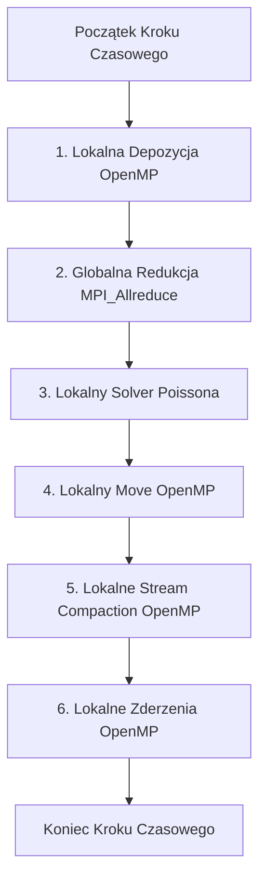

# Lekcja 6: Hybrydowe Wzorce PIC/MCC (Particle Decomposition & Replicated Grid)

W tej ostatniej lekcji połączymy całą zdobytą wiedzę, aby zaprojektować architekturę hybrydową **MPI + OpenMP** dla naszej symulacji `eduPIC`. Omówimy wzorzec **Dekompozycji Cząstek przy Powielonej Siatce (Particle Decomposition / Replicated Grid)**, który jest standardem dla jednowymiarowych kodów PIC.

---

## 1. Wybór strategii: Dekompozycja Domeny vs Dekompozycja Cząstek

W symulacjach 2D/3D na klastrach często stosuje się **Dekompozycję Domeny (Domain Decomposition)**: dzielimy siatkę przestrzenną na pod-obszary, a procesy MPI wymieniają się cząstkami przekraczającymi granice obszarów za pomocą `MPI_Send`/`MPI_Recv`. Jest to trudne w implementacji.

Dla symulacji 1D (takiej jak nasza), gdzie siatka jest bardzo mała ($N_G = 400$), znacznie lepsza i prostsza jest **Dekompozycja Cząstek z Powieloną Siatką (Particle Decomposition / Replicated Grid)**:
*   **Powielona Siatka (Replicated Grid)**: Każdy proces MPI posiada we własnej pamięci pełną kopię tablic siatki (gęstość, pole, potencjał – to tylko 400 elementów `double` $\approx 3.2$ KB).
*   **Dekompozycja Cząstek (Particle Decomposition)**: Cząstki są dzielone równo pomiędzy procesy MPI na samym początku symulacji. 
    *   Jeśli mamy $100\ 000$ elektronów i 2 procesy MPI, to Proces 0 zarządza swoimi $50\ 000$ cząstkami, a Proces 1 swoimi $50\ 000$.
    *   **Kluczowa cecha**: Cząstki **nigdy** nie migrują (nie są przesyłane sieciowo) między procesami MPI! Bez względu na to, gdzie cząstka przemieści się w przestrzeni symulacji, pozostaje ona w tablicy tego samego procesu MPI. Zmiany położeń i prędkości są całkowicie lokalne.

---

## 2. Przepływ Kroku Czasowego w Modelu Hybrydowym (MPI+OpenMP)

Oto jak wygląda realizacja pojedynczego kroku czasowego w hybrydowym programie `eduPIC`:



### Krok 1: Lokalna Depozycja (Charge Deposition)
*   **Działanie**: Każdy proces MPI za pomocą wątków OpenMP (czyli metody zoptymalizowanej w poprzednim kroku przy użyciu redukcji OpenMP i prealokowanych buforów) oblicza gęstość ładunku **wyłącznie dla posiadanych przez siebie cząstek**.
*   **Wynik**: Na każdym procesie powstają tablice gęstości `e_density_local` i `i_density_local` (z ładunkiem pochodzącym tylko z połowy cząstek).

### Krok 2: Globalna Redukcja Siatek
*   **Działanie**: Wątek główny procesu MPI wywołuje funkcję `MPI_Allreduce`:
    ```cpp
    MPI_Allreduce(e_density_local, e_density, N_G, MPI_DOUBLE, MPI_SUM, MPI_COMM_WORLD);
    MPI_Allreduce(i_density_local, i_density, N_G, MPI_DOUBLE, MPI_SUM, MPI_COMM_WORLD);
    ```
*   **Wynik**: Po tej operacji, na **wszystkich** procesach globalne tablice `e_density` i `i_density` zawierają sumaryczną gęstość ładunku ze wszystkich cząstek w całej symulacji.

### Krok 3: Rozwiązanie równania Poissona (Poisson Solver)
*   **Działanie**: Każdy proces MPI wykonuje u siebie sekwencyjnie funkcję `solve_Poisson`.
*   **Dlaczego lokalnie i sekwencyjnie?** Ponieważ siatka ma tylko 400 węzłów, rozwiązanie zajmuje mniej niż 1 mikrosekundę. Gdybyśmy chcieli zrównoleglić ten krok sieciowo, komunikacja trwałaby znacznie dłużej niż same obliczenia. Wykonanie tego kroku niezależnie na każdym procesie daje zerowy narzut komunikacyjny!

### Krok 4: Pchnięcie Cząstek (Particle Move)
*   **Działanie**: Każdy proces MPI za pomocą wątków OpenMP przesuwa swoje cząstki w oparciu o globalne pole elektryczne `efield` (wyliczone w kroku 3).
*   **Wynik**: Obliczenia są w 100% zrównoleglone i niezależne.

### Krok 5: Sprawdzenie Granic (Boundary Check)
*   **Działanie**: Każdy proces MPI lokalnie wykonuje Stream Compaction dla swoich cząstek (usuwanie tych, które uderzyły w elektrodę).
*   **Wynik**: Liczniki zaabsorbowanych cząstek (`N_e_abs_pow` itp.) oraz histogramy energii IFED są inkrementowane lokalnie. Na sam koniec symulacji (lub w celach diagnostycznych) można je zsumować za pomocą prostego `MPI_Reduce`.

### Krok 6: Zderzenia Monte Carlo (MCC)
*   **Działanie**: Każdy proces MPI wykonuje zderzenia lokalnych cząstek z gazem tła, używając prealokowanych buforów wątków OpenMP.
*   **Wynik**: Cząstki powstałe w wyniku jonizacji są lokalnie dopisywane do tablic procesu roboczego.

---

## 3. Podsumowanie Korzyści Modelu Hybrydowego dla eduPIC

Wdrożenie hybrydowe **Replicated Grid / Particle Decomposition** posiada ogromne zalety:
1.  **Łatwość wdrożenia**: Nie wymaga skomplikowanego przesyłania cząstek przez sieć przy przekraczaniu granic. Dane cząstek nigdy nie opuszczają swojego procesu MPI.
2.  **Minimalna komunikacja sieciowa**: Jedynymi danymi przesyłanymi przez sieć w każdym kroku czasowym są dwie tablice o rozmiarze $N_G = 400$ elementów double (łącznie zaledwie $6.4$ KB danych na krok). Jest to ekstremalnie mały narzut sieciowy.
3.  **Wysoka wydajność**: Obliczenia fizyczne (ruch, depozycja, zderzenia), które zajmują 99% czasu symulacji, skalują się doskonale zarówno za pomocą wątków (OpenMP), jak i procesów (MPI).

---

## 🎉 Gratulacje!
Ukończyłeś cały kurs teoretyczno-praktyczny przygotowujący do wdrożenia MPI i hybrydyzacji kodu! 

Posiadasz teraz kompletną wiedzę na temat:
*   Różnic w modelach pamięci,
*   Komunikacji punkt-punkt oraz zbiorowej,
*   Mechanizmu redukcji globalnej (`MPI_Allreduce`),
*   Zarządzania wątkami OpenMP wewnątrz procesów MPI (`MPI_Init_thread`),
*   Architektury przepływu danych w hybrydowym PIC.

W następnym kroku przejdziemy do wdrożenia tej hybrydowej architektury bezpośrednio w kodzie `eduPIC`!
