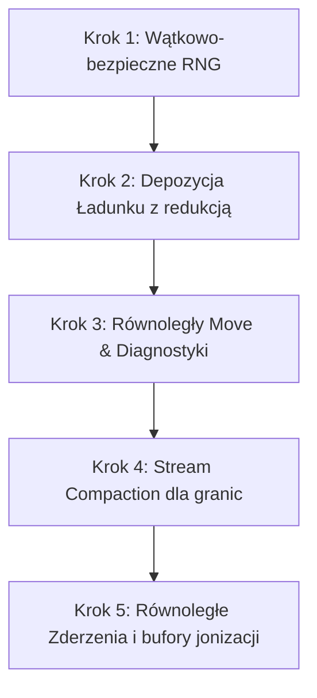

# Plan Wdrożenia i Testowania Wersji Równoległej (C/C++)

Niniejszy dokument przedstawia plan przepisywania kodu eduPIC na wersję równoległą, analizę różnic w kodzie dla poszczególnych podejść oraz szczegółowy plan testowania poprawności i wydajności.

---

## 1. Różnice w Kodzie dla Różnych Podejść

Tak, różne podejścia zrównoleglenia wymagają odmiennego projektowania architektury kodu:

### Podejście A: Czyste OpenMP (Shared Memory)
*   **Architektura**: Jeden wspólny proces. Cząstki leżą w jednej wielkiej globalnej tablicy.
*   **Kod**: Zmiany są lokalne. Wprowadzamy dyrektywy `#pragma omp parallel` wewnątrz funkcji w `simulation.h` (np. przy ruchu cząstek i depozycji).
*   **Trudność**: Średnia. Głównym wyzwaniem jest sprywatyzowanie generatorów liczb losowych i tablic diagnostycznych XT, a także zastąpienie sekwencyjnego usuwania cząstek ("swap z ostatnim") bezpiecznym algorytmem równoległym.

### Podejście B: Hybryda MPI + OpenMP (Distributed + Shared Memory)
Na maszynach wieloprocesorowych (np. AMD EPYC z 2 socketami) najskuteczniejsza jest **dekompozycja cząstek ze współdzieloną siatką (Particle Decomposition / Replicated Grid)**:
*   **Architektura**: Każdy proces MPI (np. 2 procesy, po jednym na procesor) zarządza własną, oddzielną podgrupą cząstek (np. Proces 0 ma cząstki 0-50k, Proces 1 ma 50k-100k). Wszystkie procesy posiadają jednak pełną siatkę potencjału i pola elektrycznego ($N_G = 400$ jest na tyle małe, że powielenie siatki w pamięci każdego procesu jest bezkosztowe).
*   **Kod**: Wymaga głębszych zmian strukturalnych:
    1.  Każdy proces MPI lokalnie deponuje ładunek swoich cząstek na siatkę.
    2.  Na koniec kroku depozycji wywołujemy **`MPI_Allreduce`**, aby zsumować gęstości ze wszystkich procesów i uzyskać globalną gęstość na każdym z nich.
    3.  Każdy proces lokalnie (sekwencyjnie) rozwiązuje równanie Poissona (ponieważ $N_G = 400$ trwa $<1$ µs, każdy robi to sam u siebie, unikając komunikacji sieciowej).
    4.  Każdy proces niezależnie przesuwa swoje cząstki i liczy ich zderzenia przy użyciu OpenMP na swoich rdzeniach.
*   **Trudność**: Wysoka, ale zapewnia najwyższą skalowalność na systemach NUMA.

---

## 2. Plan Wdrożenia Krok po Kroku (Najpierw Czyste OpenMP)

Zalecam rozpoczęcie od wersji **czystego OpenMP**, ponieważ stanowi ona bazę do optymalizacji pojedynczego gniazda procesora, a jej komponenty zostaną bezpośrednio użyte w wersji hybrydowej.

1.  **Krok 1 (RNG)**: Stworzenie tablicy generatorów `std::mt19937` (po jednym na wątek) i zastąpienie globalnego `MTgen`.
2.  **Krok 2 (Depozycja)**: Wdrożenie prywatnych tablic gęstości wątków w `step1_compute_electron_density` i zsumowanie ich na koniec kroku.
3.  **Krok 3 (Move)**: Zrównoleglenie pętli pchnięcia cząstek, wdrożenie redukcji/blokad dla tablic diagnostycznych.
4.  **Krok 4 (Granice)**: Przepisanie usuwania cząstek. Zamiast modyfikacji w miejscu, implementujemy algorytm dwuetapowy:
    *   Wątki oznaczają cząstki do usunięcia.
    *   Wykonujemy równoległą sumę prefiksową w celu skompresowania tablicy (Stream Compaction).
5.  **Krok 5 (Zderzenia)**: Zrównoleglenie wyboru i fizyki zderzeń. Wdrożenie lokalnych buforów wątków na nowo wygenerowane cząstki w procesie jonizacji.

---

## 3. Strategia i Plan Testów (Test-Driven Parallelization)

Przed modyfikacją kodu głównego musimy przygotować infrastrukturę testową, aby mieć 100% pewności, że wersja równoległa nie wprowadza błędów numerycznych.

### A. Testy Poprawności Algorytmów Równoległych (Unit Tests)

Należy napisać testy jednostkowe (np. w pliku `C/tests/test_parallel_components.cc`) weryfikujące:

1.  **Test generatora liczb losowych (RNG)**:
    *   *Metoda*: Sprawdzenie, czy losowania z różnych wątków przy użyciu generatorów wątkowo-lokalnych dają poprawne rozkłady statystyczne (jednorodny i normalny) i czy nie dochodzi do zakleszczeń lub wyścigów.
2.  **Test depozycji ładunku (Charge Deposition Reduction)**:
    *   *Metoda*: Uruchomienie depozycji tej samej (testowej) tablicy cząstek sekwencyjnie oraz w wersji równoległej (OpenMP). Test przechodzi pomyślnie, jeśli wynikowe tablice gęstości `e_density` są identyczne co do bitu.
3.  **Test Stream Compaction (Boundary Check)**:
    *   *Metoda*: Przygotowanie tablicy cząstek, z których część leży poza obszarem symulacji ($x < 0$ lub $x > L$). Porównanie indeksów i współrzędnych cząstek po kompresji tablicy w wersji sekwencyjnej (swap z ostatnim) oraz równoległej. Kolejność końcowa cząstek może być inna, ale ich liczba i wartości muszą być identyczne.
4.  **Test buforowania jonizacji (Ionization Buffer)**:
    *   *Metoda*: Wywołanie sztucznego kroku zderzeń jonizacyjnych w wielu wątkach. Weryfikacja, czy buforowanie wątków i późniejsze scalenie ich do globalnej tablicy poprawnie alokuje pamięć i przepisuje dane bez wyścigów.

### B. Testy Konsystencji Fizycznej (Regression Tests)

Symulacje PIC są chaotyczne i bardzo wrażliwe na drobne zmiany (ze względu na zjawisko niestabilności numerycznych i losowość zderzeń). Czyste porównanie bit-w-bit po wielu krokach czasowych może się różnić ze względu na inną kolejność losowań.

1.  **Test statystycznej zbieżności**:
    *   *Metoda*: Uruchomienie symulacji sekwencyjnej i równoległej na 1000 kroków czasowych.
    *   *Weryfikacja*: Porównanie średniej liczby cząstek ($N_e$, $N_i$) oraz energii średniej. Różnica nie powinna przekraczać błędu statystycznego (np. $< 1\%$).
2.  **Test deterministyczny (dla tej samej liczby wątków)**:
    *   *Metoda*: Jeśli przypiszemy cząstki do wątków w sposób deterministyczny i zablokujemy liczbę wątków (np. zawsze 4 wątki), to przy tym samym ziarnie (seed) program równoległy powinien dawać **identyczne bitowo wyniki** przy każdym uruchomieniu.

### C. Testy Skalowania (Performance Benchmarks)

Musimy upewnić się, że zrównoleglenie przynosi zysk wydajnościowy:

1.  **Test Skalowania Silnego (Strong Scaling Test)**:
    *   Uruchomienie symulacji dla $N_e = 200\,000$ cząstek na 1, 2, 4, 8, 16, 32, 64 rdzeniach.
    *   *Oczekiwany rezultat*: Wykres Speedup vs Cores wykazujący wzrost wydajności.
2.  **Test profilowania barier pamięci (Cache Misses)**:
    *   Uruchomienie pod narzędziem `perf` w celu weryfikacji, czy wersja równoległa nie zwiększyła liczby chybień cache LLC z powodu fałszywego współdzielenia (False Sharing).
