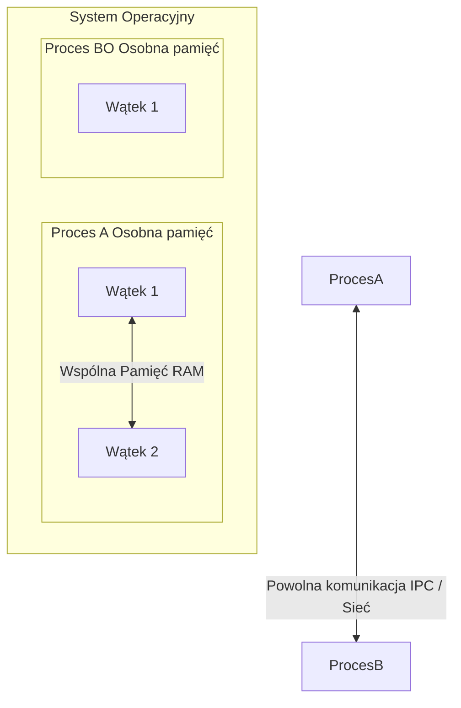

# Rozdział 1: Współbieżność a Równoległość – Wielkie Rozróżnienie

Witaj w pierwszym rozdziale kursu! Zanim napiszemy chociażby jedną linię kodu wielowątkowego, musimy dokładnie uporządkować pojęcia. W potocznym języku słowa „współbieżny” i „równoległy” są często używane zamiennie jako określenie wykonywania czegoś „w tym samym czasie”. W informatyce mają one jednak zupełnie różne znaczenia i odnoszą się do innych warstw systemu.

---

## 1. Perspektywa logiczna a fizyczna

Aby dobrze zrozumieć te pojęcia, podzielmy nasz problem na dwie perspektywy:
*   **Perspektywa logiczna (struktura kodu)**: Jak projektujemy naszą aplikację. Czy dzielimy ją na niezależne zadania (np. pobieranie pliku, odtwarzanie muzyki, zapis do bazy)?
*   **Perspektywa fizyczna (wykonanie kodu)**: Jak nasz procesor (sprzęt) faktycznie wykonuje te zadania w danym ułamku sekundy.

---

## 2. Współbieżność (Concurrency) – Logiczny podział pracy

> [!NOTE]
> **Współbieżność** to cecha struktury programu. Program jest współbieżny, jeśli został podzielony na niezależne zadania, które **mogą** być wykonywane w dowolnej kolejności lub przeplatane w czasie.

Współbieżność polega na **zarządzaniu wieloma zadaniami naraz**. Wyobraź sobie system operacyjny na starym komputerze z jednordzeniowym procesorem. Mogłeś jednocześnie słuchać muzyki i pisać dokument w Wordzie. Procesor fizycznie nie robił tych rzeczy w tym samym czasie. Zamiast tego wykonywał ułamek kodu odtwarzacza, potem przełączał się na Worda, potem znowu na odtwarzacz.

To zjawisko nazywamy **przełączaniem kontekstu (Context Switching)**. Ponieważ przełączanie dzieje się bardzo szybko (np. co kilka milisekund), jako ludzie ulegamy iluzji jednoczesności.

### Wizualizacja współbieżności na 1 rdzeniu CPU (Context Switching):

```mermaid
gantt
    title Współbieżność (1 Rdzeń CPU)
    dateFormat  X
    axisFormat %s
    section Zadanie A (Word)
    Word 1           :active, a1, 0, 2
    Word 2           :active, a2, 4, 6
    section Zadanie B (Muzyka)
    Muzyka 1         :active, b1, 2, 4
    Muzyka 2         :active, b2, 6, 8
```

---

## 3. Równoległość (Parallelism) – Fizyczna jednoczesność

> [!NOTE]
> **Równoległość** to cecha wykonania programu. Program działa równolegle, jeśli w tym samym ułamku sekundy na fizycznie różnych rdzeniach procesora (lub różnych procesorach) wykonywane są przynajmniej dwa różne zadania.

Równoległość polega na **wykonywaniu wielu zadań naraz**. Wymaga ona fizycznego wsparcia ze strony sprzętu – musimy dysponować procesorem wielordzeniowym lub klastrem wielu komputerów.

### Wizualizacja równoległości na 2 rdzeniach CPU:

```mermaid
gantt
    title Równoległość (2 Rdzenie CPU)
    dateFormat  X
    axisFormat %s
    section Rdzeń 1 (Zadanie A)
    Word             :active, r1, 0, 8
    section Rdzeń 2 (Zadanie B)
    Muzyka           :active, r2, 0, 8
```

---

## 4. Analogia z życia codziennego: Kucharz w kuchni

Wyobraź sobie przygotowywanie obiadu (musisz pokroić cebulę i mieszać gotującą się zupę):

*   **Współbieżność (1 kucharz)**: Kucharz kroi cebulę przez 10 sekund, potem odkłada nóż, podchodzi do garnka i miesza zupę przez 5 sekund, po czym wraca do krojenia. Kucharz zarządza dwoma zadaniami współbieżnie. Przełącza swój kontekst pracy. W żadnym momencie nie wykonuje obu czynności naraz.
*   **Równoległość (2 kucharzy)**: W kuchni stoi dwóch kucharzy. Jeden z nich cały czas kroi cebulę, a w tym samym czasie drugi miesza zupę w garnku. Zadania są wykonywane fizycznie równolegle.

---

## 5. Abstracje Systemowe: Proces vs Wątek

Aby uruchomić kod współbieżnie lub równolegle, system operacyjny udostępnia nam dwie podstawowe jednostki abstrakcji: **Proces** oraz **Wątek**.

### Proces (Process)
Proces to uruchomiony program. Posiada swoją całkowicie wydzieloną, odizolowaną przez system operacyjny przestrzeń adresową w pamięci RAM.
*   **Izolacja**: Proces A nie może odczytać ani zapisać pamięci należącej do Procesu B. Jeśli proces się zawiesi (wykona niedozwoloną operację), system go zabije, ale pozostałe procesy będą działać dalej.
*   **Komunikacja**: Przekazywanie danych między dwoma procesami wymaga zaangażowania systemu operacyjnego i jest powolne (tzw. IPC – *Inter-Process Communication*, gniazda sieciowe, pliki).
*   **Koszt**: Utworzenie procesu i przełączanie kontekstu między procesami jest kosztowne czasowo i pamięciowo.

### Wątek (Thread)
Wątek (nazywany czasem lekkim procesem – *lightweight process*) to pojedyncza ścieżka wykonania kodu wewnątrz procesu.
*   **Współdzielenie pamięci**: Wszystkie wątki uruchomione wewnątrz jednego procesu współdzielą tę samą przestrzeń adresową pamięci RAM (widzą te same zmienne globalne, stertę itp.).
*   **Komunikacja**: Komunikacja jest niezwykle szybka, ponieważ polega po prostu na odczycie i zapisie tych samych komórek pamięci (zmiennych).
*   **Koszt**: Tworzenie wątków i przełączanie kontekstu między wątkami tego samego procesu jest znacznie tańsze niż w przypadku procesów.
*   **Ryzyko**: Brak izolacji oznacza, że błąd w jednym wątku (np. SEGFAULT w C++) zabija cały proces. Ponadto współdzielenie pamięci rodzi ryzyko jednoczesnego zapisu, co prowadzi do błędów (szczegółowo w Rozdziale 4).

### Porównanie procesów i wątków:

| Cecha | Proces | Wątek |
| :--- | :--- | :--- |
| **Przestrzeń adresowa** | Całkowicie odizolowana | Współdzielona w ramach jednego procesu |
| **Koszt utworzenia** | Bardzo wysoki | Niski |
| **Przełączanie kontekstu** | Wolne (wymaga zmiany tablic stron pamięci) | Szybkie (wspólne mapowanie pamięci) |
| **Komunikacja** | Trudna i powolna (IPC, gniazda, pliki) | Bardzo prosta i szybka (odczyt/zapis pamięci) |
| **Niezawodność** | Wysoka (błąd jednego procesu nie wpływa na inne) | Niska (błąd jednego wątku kończy cały program) |

---

## 6. Krótkie podsumowanie i samosprawdzenie

1.  **Czy system współbieżny musi być równoległy?**
    *Nie.* Możemy mieć współbieżną strukturę kodu (np. aplikacja podzielona na 20 wątków), która na jednordzeniowym procesorze komputera jednopłytkowego (np. stare Raspberry Pi) będzie wykonywać się wyłącznie współbieżnie przez przełączanie kontekstu, nigdy równolegle.
2.  **Czy system równoległy musi być współbieżny?**
    *Tak.* Aby wykonać coś równolegle, z definicji musimy najpierw logicznie podzielić problem na współbieżne podzadania.
3.  **Kiedy lepiej użyć procesów, a kiedy wątków?**
    *   **Procesy** są lepsze, gdy zależy nam na bezpieczeństwie i izolacji (np. przeglądarka internetowa otwiera każdą kartę w osobnym procesie, aby awaria jednej strony nie zamknęła przeglądarki).
    *   **Wątki** są lepsze, gdy realizujemy gęste obliczenia numeryczne na wspólnych danych (tak jak w naszej symulacji PIC/MCC) i zależy nam na maksymalnym skróceniu czasu wymiany informacji.

---

## Ćwiczenie do przemyślenia:
Zastanów się nad symulacją Particle-in-Cell (eduPIC), którą optymalizowaliśmy. 
*   Czy ruch elektronów i ruch jonów na komputerze z 8 rdzeniami jest zadaniem współbieżnym?
*   Czy jest to zadanie równoległe?
*   Co jest wątkiem, a co procesem w czasie uruchamiania `go run main.go` na klastrze HPC?
