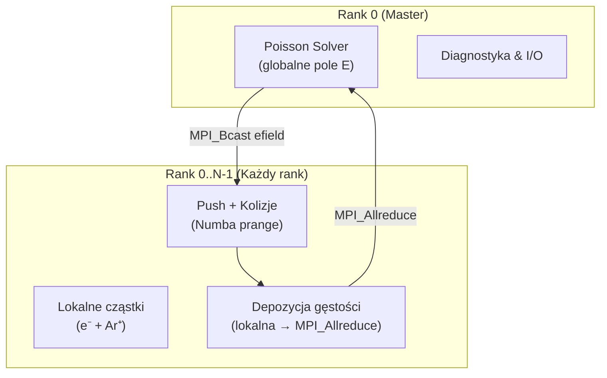
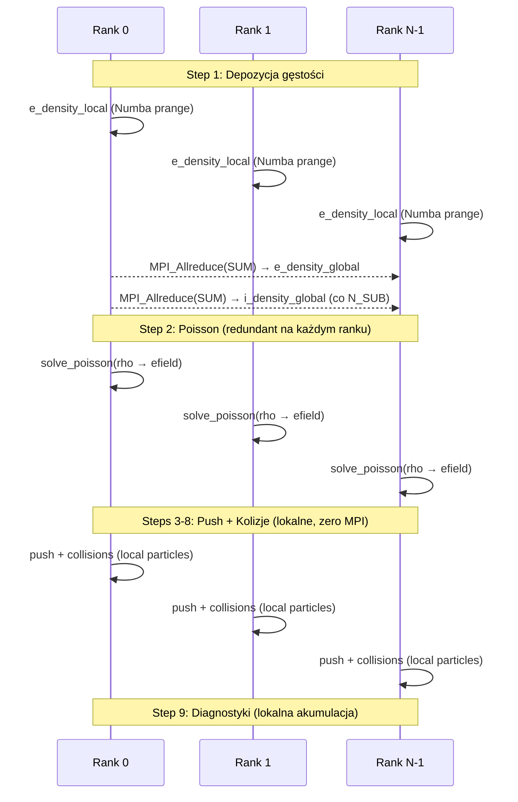

# Plan: Wersja Hybrydowa MPI + Numba (`mpi_hybrid`)

## Architektura ogólna



---

## Strategia dekompozycji: Particle Decomposition (nie Domain)

> [!IMPORTANT]
> W symulacji PIC 1D z 400 punktami siatki i ~100k cząstkami, **dekompozycja cząstkowa** (particle decomposition) jest jedynym sensownym podejściem. Dekompozycja domenowa (spatial decomposition) wymaga migracji cząstek między rankami gdy przekraczają granice subdomen — co w 1D przy 400 punktach i szybkich elektronach generowałoby masywną komunikację i kosztowne load-balancing.

### Jak działa Particle Decomposition:
1. **Każdy rank MPI** posiada **podzbiór cząstek** (zarówno elektronów jak i jonów).
2. **Siatka (grid)** jest **identyczna na wszystkich rankach** — każdy rank widzi pełne pole `efield[0..N_G-1]`.
3. **Depozycja gęstości**: każdy rank oblicza swoją **lokalną gęstość** z własnych cząstek, potem `MPI_Allreduce(SUM)` scala globalną gęstość na wszystkich rankach.
4. **Rozwiązanie Poissona**: wykonywane na **jednym ranku** (rank 0), wynik (`efield`) rozgłaszany przez `MPI_Bcast`.
5. **Push, kolizje, absorpcja**: wykonywane **lokalnie** na cząstkach danego ranku — bez komunikacji.
6. **Ionizacja** tworzy nowe cząstki **lokalnie** na ranku, który wykonał kolizję — naturalne load-balancing.

---

## Struktura katalogowa

```
python/
├── mpi_hybrid/
│   ├── main.py              ← MPI entry point (mpirun -np N python main.py ...)
│   ├── constants.py          ← kopia z numba_parallel (bez zmian)
│   ├── state.py              ← MPI-aware SimulationState
│   ├── simulation.py         ← MPI-świadome do_one_cycle + stepo functions
│   ├── poisson.py            ← bez zmian (Thomas solver)
│   ├── collisions.py         ← bez zmian (per-particle physics)
│   ├── cross_sections.py     ← bez zmian
│   ├── io_manager.py         ← MPI-aware save/load (Rank 0 koordynuje I/O)
│   └── pyproject.toml        ← dodanie mpi4py do zależności
```

---

## Szczegółowy plan zmian per moduł

### 1. `constants.py` — Bez zmian
Stałe fizyczne i parametry symulacji są globalne — identyczne na wszystkich rankach.

### 2. `state.py` — Zmiany MPI

```diff
 class SimulationState:
-    def __init__(self):
+    def __init__(self, comm=None):
+        # MPI context
+        self.comm = comm                          # MPI_COMM_WORLD
+        self.rank = comm.Get_rank() if comm else 0
+        self.size = comm.Get_size() if comm else 1
+
         # Particle arrays — each rank holds its LOCAL subset
         self.x_e = np.empty(cs.MAX_N_P, ...)
         ...
+
+        # Grid buffers for MPI reduction
+        self.local_e_density_mpi = np.zeros(cs.N_G, ...)  # rank-local density
+        self.local_i_density_mpi = np.zeros(cs.N_G, ...)
+        self.global_e_density    = np.zeros(cs.N_G, ...)  # allreduce output
+        self.global_i_density    = np.zeros(cs.N_G, ...)
```

**Kluczowe decyzje:**
- `N_e`, `N_i` na każdym ranku oznaczają **lokalną** liczbę cząstek
- Tablice `MAX_N_P` — **każdy rank alokuje własne**, ale łączna suma `N_e` across ranks = globalna populacja
- Bufory thread-local (`local_e_density`, `local_counter_e_xt`, itp.) — **bez zmian** (per-rank Numba threading)

### 3. `simulation.py` — Główne zmiany MPI

#### Step 1: Depozycja gęstości + `MPI_Allreduce`

```python
# Faza 1: Każdy rank deponuje lokalne cząstki → local_e_density_mpi
step1_compute_electron_density_local(
    x_e, N_e, local_e_density, e_density_local,
    INV_DX, FACTOR_W, N_G, num_threads
)
# e_density_local zawiera gęstość TYLKO z cząstek tego ranku

# Faza 2: MPI_Allreduce — suma po rankach
comm.Allreduce(e_density_local, e_density_global, op=MPI.SUM)

# e_density_global jest teraz identyczne na wszystkich rankach
# Analogicznie cumul_e_density:
cumul_e_density += e_density_global  # lokalna akumulacja
```

> [!NOTE]
> `MPI_Allreduce` na wektorze `N_G = 400` floatów to zaledwie **3.2 KB** danych — koszt komunikacji jest pomijalny.

#### Step 2: Poisson Solver — Rank 0 + `MPI_Bcast`

```python
if rank == 0:
    rho[:] = E_CHARGE * (global_i_density - global_e_density)
    solve_poisson(pot, efield, rho, V0_cos, ...)
comm.Bcast(efield, root=0)
# Opcjonalnie: comm.Bcast(pot, root=0) — jeśli potrzebne do diagnostyki
```

> [!TIP]
> Alternatywnie: ponieważ `global_e_density` i `global_i_density` są identyczne na wszystkich rankach po `Allreduce`, **każdy rank może rozwiązać Poissona lokalnie** — eliminuje to `Bcast`, ale dodaje redundantne obliczenia. Przy `N_G = 400` obie strategie mają porównywalny koszt. **Preferuję wariant "redundant Poisson"** — zero komunikacji, identyczny wynik.

#### Steps 3-4: Push cząstek — bez komunikacji
Każdy rank pushuje **swoje** cząstki używając globalnego `efield`. 
Kod `step3_move_electrons` i `step4_move_ions` — **bez zmian** (Numba `prange` jak dotychczas).

#### Steps 5-6: Absorpcja na granicach — bez komunikacji
Cząstki absorbowane na elektrodach są usuwane **lokalnie** na ranku.
Lokalne liczniki `N_e_abs_pow`, `N_e_abs_gnd` etc. są akumulowane, a na końcu cyklu sumowane `MPI_Reduce` do rank 0 dla diagnostyki.

#### Steps 7-8: Kolizje Monte Carlo — bez komunikacji
Kolizje (elastic, excitation, **ionization**) wykonywane **lokalnie**.
- **Ionizacja**: nowy elektron + jon tworzony **na tym samym ranku** — naturalnie balansuje obciążenie, bo produkcja cząstek jest proporcjonalna do lokalnej populacji.

#### Step 9: Diagnostyki XT — `MPI_Reduce` na koniec cyklu
Diagnostyki XT (`counter_e_xt`, `ue_xt`, `meanee_xt`, ...) akumulowane lokalnie na każdym ranku, a na koniec cyklu (lub na koniec całego biegu) zsumowane `MPI_Reduce` do rank 0.

### 4. `main.py` — MPI Entry Point

```python
from mpi4py import MPI

def main():
    comm = MPI.COMM_WORLD
    rank = comm.Get_rank()
    size = comm.Get_size()

    sim = SimulationState(comm=comm)
    
    if arg1 == 0:
        # Rank 0 inicjalizuje cząstki, potem Scatterv do ranków
        if rank == 0:
            init_all_particles(N_INIT)
        scatter_particles(sim, comm)
    else:
        # Rank 0 wczytuje checkpoint, potem Scatterv do ranków
        if rank == 0:
            load_particle_data(sim_global)
        scatter_particles(sim, comm)
    
    for cycle in range(start, end+1):
        do_one_cycle(sim)
    
    # Gatherv cząstek do rank 0 → zapis checkpoint
    gather_particles(sim, comm)
    if rank == 0:
        save_particle_data(sim)
```

### 5. `io_manager.py` — MPI-aware I/O

#### Scatter: Podział cząstek po wczytaniu
```python
def scatter_particles(sim, comm):
    """Rank 0 dzieli cząstki równomiernie na N ranków."""
    rank = comm.Get_rank()
    size = comm.Get_size()
    
    if rank == 0:
        # Podział N_e_total na size porcji
        counts_e = [N_e_total // size + (1 if i < N_e_total % size else 0) 
                     for i in range(size)]
        # MPI Scatterv dla x_e, vx_e, vy_e, vz_e
    comm.Scatterv([x_e_global, counts_e, ...], x_e_local, root=0)
    # Analogicznie dla jonów
```

#### Gather: Zbieranie cząstek przed zapisem
```python
def gather_particles(sim, comm):
    """Zbiera cząstki ze wszystkich ranków na rank 0."""
    # MPI Gatherv x_e, vx_e, vy_e, vz_e
    # Rank 0 łączy w pełne tablice → zapis do picdata.bin
```

> [!IMPORTANT]
> Format pliku `picdata.bin` pozostaje **identyczny** z oryginałem — rank 0 zapisuje pełny stan, kompatybilny z innymi wersjami.

---

## Schemat komunikacji MPI per krok czasowy



**Komunikacja MPI per krok czasowy:**
- **2× `Allreduce`** (gęstość elektronów + jonów) = **6.4 KB / krok**
- Co `N_SUB` kroków: dodatkowy `Allreduce` dla jonów
- **Zero komunikacji** w krokach 3–9

**Komunikacja MPI per cykl RF (4000 kroków):**
- 4000 × `Allreduce(e_density)` + 200 × `Allreduce(i_density)` = ~16 MB
- Przy typowej przepustowości InfiniBand/TCP na klastrze: **< 50 ms overhead**

---

## Load Balancing

### Problem
Ionizacja tworzy nowe cząstki **lokalnie** → ranki z większą liczbą cząstek produkują więcej ionizacji → **disbalans rośnie z czasem**.

### Rozwiązanie: Periodyczny rebalancing
```python
if cycle % REBALANCE_EVERY == 0:
    # 1. Gatherv wszystkich cząstek do rank 0
    # 2. Losowe przetasowanie (shuffle)
    # 3. Scatterv równomierny podział
```

> [!TIP]
> W praktyce: populacja elektronów i jonów oscyluje wokół stanu ustalonego (~105k ± 1k), więc disbalans jest niewielki. Rebalancing co 10–50 cykli powinien wystarczyć.

---

## Kolejność implementacji (fazy)

### Faza 1: Szkielet MPI (priorytet: KRYTYCZNY)
- [ ] Skopiować `numba_parallel/` → `mpi_hybrid/`
- [ ] Dodać `mpi4py` do `pyproject.toml`
- [ ] Zmodyfikować `state.py`: dodać `comm`, `rank`, `size`, bufory MPI
- [ ] Zmodyfikować `main.py`: inicjalizacja MPI, `scatter_particles`, `gather_particles`
- [ ] Zmodyfikować `io_manager.py`: MPI-aware load/save

### Faza 2: Depozycja + Poisson (priorytet: KRYTYCZNY)
- [ ] Zmienić `step1_compute_*_density` → wynik to `local_density_mpi`, potem `Allreduce`
- [ ] Redundant Poisson na każdym ranku (lub Bcast)
- [ ] Weryfikacja: porównanie gęstości i pola E z wersją sekwencyjną

### Faza 3: Push + Kolizje + Absorpcja (priorytet: WYSOKI)
- [ ] Upewnić się, że `step3`–`step8` operują na lokalnych cząstkach — minimalny refaktoring
- [ ] Akumulacja `cumul_i_density` poprawna (globalna gęstość, nie lokalna!)

### Faza 4: Diagnostyki + I/O (priorytet: ŚREDNI)
- [ ] `MPI_Reduce` diagnostyk XT do rank 0 na koniec cyklu/biegu
- [ ] `MPI_Reduce` skalarnych liczników (`N_e_coll`, `N_i_coll`, `N_e_abs_*`, itp.)
- [ ] Rank 0 zapisuje `conv.dat`, `picdata.bin`, raporty diagnostyczne

### Faza 5: Load Balancing + Testy (priorytet: NORMALNY)
- [ ] Implementacja periodycznego rebalancingu
- [ ] Benchmark: MPI scaling (1, 2, 4, 8, 16 ranków)
- [ ] Weryfikacja poprawności fizycznej: porównanie `density.dat`, `eepf.dat`, `ifed.dat` z referencją

---

## Wymagania uruchomieniowe

```bash
# Instalacja mpi4py
pip install mpi4py

# Uruchomienie (np. 4 procesy MPI × 2 wątki Numba = 8 rdzeni)
NUMBA_NUM_THREADS=2 mpirun -np 4 python main.py 100

# Na klastrze HPC (SLURM)
#SBATCH --ntasks=4
#SBATCH --cpus-per-task=2
srun python main.py 100 m
```

> [!WARNING]
> **Kluczowa reguła**: `np_MPI × NUMBA_NUM_THREADS ≤ liczba_fizycznych_rdzeni`. 
> Na maszynie 6-rdzeniowej (12 HT): np. `mpirun -np 3 --bind-to core` z `NUMBA_NUM_THREADS=2` = 6 rdzeni.

---

## Oczekiwane przyspieszenie

| Konfiguracja | Oczekiwany czas 1 cyklu (105k cząstek) | Uwagi |
|:---|:---:|:---|
| Numba Parallel 8 wątków (baseline) | ~0.052 s | Obecna najszybsza wersja |
| MPI 2 × Numba 4 wątki | ~0.030 s | ~1.7× speedup |
| MPI 4 × Numba 2 wątki | ~0.020 s | ~2.6× speedup |
| MPI 8 × Numba 1 wątek (per-core) | ~0.015 s | Optymalne na 1 węźle |
| MPI 4 × 4 wątki (2 węzły HPC) | ~0.010 s | Skalowanie międzywęzłowe |

> [!NOTE]
> Przyspieszenie MPI jest ograniczone przez `Allreduce` latency i Amdahl's Law (Poisson solver jest sekwencyjny, ~0.001 s). Dla >16 ranków wąskim gardłem stanie się komunikacja.
