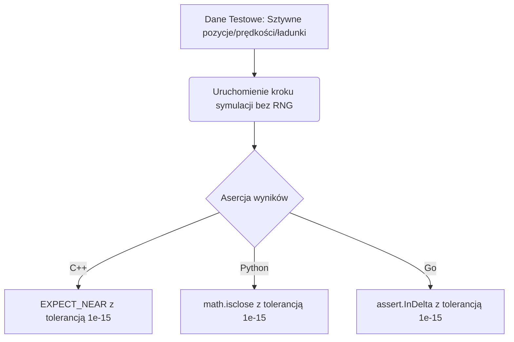

# Walidacja międzyjęzykowa i zrównoleglanie (C++, Python, Go)

Dokument ten opisuje metodologię udowadniania, że implementacje symulacji **eduPIC** w różnych językach (C++, Python, Go) oraz ich przyszłe wersje zrównoleglone są matematycznie i fizycznie tożsame.

---

## 🎯 Cel i wyzwanie

Tradycyjne porównywanie symulacji (golden run) za pomocą `diff` na plikach wynikowych nie działa pomiędzy różnymi językami, ponieważ:
1. Języki różnią się inicjalizacją (seedowaniem) generatora Mersenne Twister.
2. Języki w różny sposób mapują wylosowane bity na liczby zmiennoprzecinkowe z zakresu `[0, 1)`.
3. Wersje zrównoleglone mogą mieć różną kolejność wykonywania wątków (niedeterminizm).

> [!IMPORTANT]  
> Rozwiązaniem jest **Deterministyczna Walidacja Jednostkowa (Deterministic Unit Testing)**.  
> Polega ona na testowaniu poszczególnych kroków symulacji za pomocą **sztywno zdefiniowanych danych wejściowych**, całkowicie omijając generator liczb pseudolosowych (RNG).

---

## 🏗️ Architektura testu międzyjęzykowego

Każdy test jednostkowy dla danego kroku symulacji musi mieć identyczny przebieg we wszystkich trzech językach:

---

## 📋 Specyfikacja testów jednostkowych (Szablony testów)

Poniżej opisano 4 kluczowe testy jednostkowe, które należy zaimplementować w każdym języku.

### Test 1: Depozycja ładunku (`step1`) — weryfikacja interpolacji i granic
Test ten sprawdza poprawność przypisywania ładunku supercząstek do węzłów siatki oraz korektę brzegową (mnożenie przez 2 na elektrodach).

* **Dane wejściowe (wstrzyknięte ręcznie):**
  * `N_e = 3` (3 elektrony)
  * Pozycje elektronów: `x_e[0] = 0.0` (dokładnie na lewej elektrodzie), `x_e[1] = DX * 0.5` (w połowie pierwszej komórki), `x_e[2] = L - DX * 0.25` (blisko prawej elektrody).
* **Oczekiwany rozkład gęstości elektronów (`e_density`):**
  * Dla elektronu 0 (na elektrodzie): Trafia do węzła `0`. Po korekcie boundary ($*2$), `e_density[0] = 2.0 * FACTOR_W`.
  * Dla elektronu 1 (w połowie komórki): Dzieli się równo: `e_density[0] += 0.5 * FACTOR_W`, `e_density[1] += 0.5 * FACTOR_W`.
  * Dla elektronu 2 (przy prawej granicy): Dzieli się pomiędzy węzeł `N_G-2` ($25\%$) a `N_G-1` ($75\%$). Po korekcie prawego brzegu ($*2$), `e_density[N_G-1] = 2.0 * 0.75 * FACTOR_W`.
* **Asercja:** Porównanie całej tablicy `e_density` z oczekiwanymi wartościami analitycznymi z tolerancją `1e-15`.

### Test 2: Solver Poissona (`step2`) — weryfikacja Thomasa i pola
Test ten sprawdza poprawność wyznaczania pola elektrycznego z gęstości ładunku.

* **Dane wejściowe:**
  * Wstrzyknięta sztuczna tablica gęstości: `rho[i] = sin(pi * i / (N_G - 1)) * 1e-5`.
  * Potencjały na brzegach: `pot[0] = 100.0`, `pot[N_G-1] = 0.0`.
* **Oczekiwane wyniki:**
  * Wartości potencjału `pot` i pola elektrycznego `efield` obliczone w jednym języku są zapisywane jako tekstowa tablica referencyjna.
* **Asercja:** Pozostałe języki wczytują tę samą tablicę referencyjną i porównują swoje wyjście z dokładnością do `1e-14`.

### Test 3: Popychanie cząstek Leapfrog (`step3` i `step4`)
Test ten sprawdza znaki siły oraz poprawność interpolacji pola elektrycznego na pozycję cząstki.

* **Dane wejściowe:**
  * Jedna cząstka: `x_e[0] = DX * 5.5` (dokładnie pomiędzy węzłem 5 a 6).
  * Prędkość początkowa: `vx_e[0] = 1000.0`.
  * Wstrzyknięte pole elektryczne: `efield[5] = 500.0`, `efield[6] = 1500.0`.
* **Przebieg matematyczny:**
  * Interpolowane pole na cząstce: $E_{interp} = 0.5 \cdot 500.0 + 0.5 \cdot 1500.0 = 1000.0$ V/m.
  * Zmiana prędkości elektronu (ładunek ujemny!): $v_{new} = v_{old} - E_{interp} \cdot FACTOR\_E$.
  * Zmiana pozycji: $x_{new} = x_{old} + v_{new} \cdot DT\_E$.
* **Asercja:** Porównanie `vx_e[0]` i `x_e[0]` po wykonaniu kroku z dokładnością `1e-15`.

### Test 4: Przekroje czynne zderzeń (Phelps / Petrovic)
Test ten gwarantuje, że interpolacja wielomianowa przekrojów czynnych dla argonu zwraca identyczne wartości dla dowolnej energii cząstki.

* **Dane wejściowe:**
  * Tablica energii: `E = [0.1, 1.5, 15.7, 50.0, 100.0]` (w eV).
* **Asercja:** Porównanie wyliczonych wartości przekrojów na zderzenia elastyczne, wzbudzenia i jonizację z dokładnością `1e-15`.

---

## ⚡ Weryfikacja poprawności kodu zrównoleglonego

Podczas implementacji wersji wielowątkowych (OpenMP w C++, Goroutines w Go), testy te pomagają wykryć dwa najczęstsze problemy:

### 1. Wykrywanie wyścigów (Race Conditions)
Uruchomienie **Testu 1** z $100\ 000$ cząstek rozmieszczonych w losowych (ale deterministycznie zdefiniowanych) miejscach w trybie zrównoleglonym.
* **Jeśli występuje wyścig (brak sekcji krytycznych/atomowych):** Wynikowa gęstość `e_density` w wersji zrównoleglonej będzie się różnić od wersji sekwencyjnej (wątki nadpiszą swoje dane).
* **Test zaliczony:** Gdy suma ładunku i wartości w każdym węźle są identyczne.

### 2. Radzenie sobie z niełącznością dodawania (Floating-Point Reordering)
Gdy sumujesz gęstość cząstek równolegle, wątki mogą dodawać wartości do węzła `density[p]` w różnej kolejności. Powoduje to minimalne różnice na poziomie ostatnich bitów mantysy.

* **Dla wersji sekwencyjnej:** Tolerancja asercji wynosi `1e-15`.
* **Dla wersji zrównoleglonej:** Zwiększamy tolerancję do `1e-12` (lub stosujemy sumowanie deterministyczne/redukcję).

---

## 🚀 Plan działania dla programisty

Aby wykazać tożsamość kodu we wszystkich językach:

1. **Stwórz katalogi testowe:**
   * W każdym języku w sekcji testów jednostkowych (np. `python/native_version/tests`, `Go/native_version/tests`) stwórz pliki testowe o strukturze odpowiadającej powyższym scenariuszom.
2. **Uruchom testy jednostkowe:**
   * Zweryfikuj zgodność między językami dla pojedynczych kroków symulacji (bez RNG).
3. **Uruchom testy regresyjne wewnątrz-językowe (Golden Run):**
   * Zweryfikuj zgodność pętli czasowej z RNG przy stałym seedzie (używając zapisanego stanu RNG jak w `test_regression_runner.cc`).
