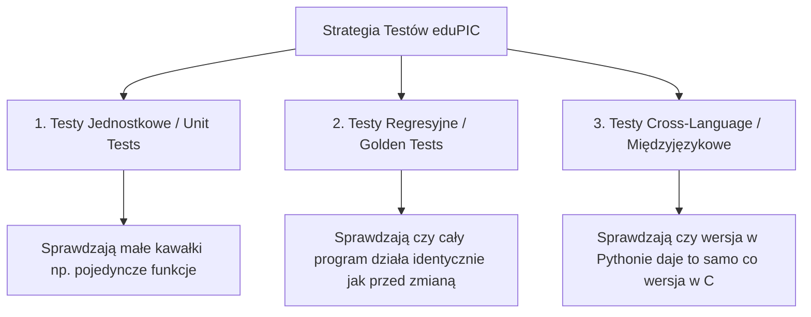

# Przewodnik po testowaniu dla studentów informatyki: Projekt eduPIC

Witaj w przewodniku po testowaniu kodu symulacji fizycznej! Jako student informatyki znasz już zapewne składnię C i Pythona oraz podstawowe struktury danych. Ten dokument wyjaśni Ci **wysokopoziomowe koncepcje testowania** oraz to, jak konkretne mechanizmy z planów testowych (`testing_plan_c.md` i `testing_plan_python.md`) przekładają się na kod.

---

## 1. Wysokopoziomowe koncepcje: Po co i jak testujemy symulacje?

W projektach naukowych i symulacjach fizycznych (takich jak Particle-in-Cell) bardzo łatwo jest zmienić jedną linijkę kodu i "zepsuć fizykę" (np. cząstki zaczną uciekać z układu, energia przestanie być zachowana, albo pole elektryczne wybuchnie do nieskończoności). Testy chronią nas przed takimi sytuacjami.

W naszych planach dzielimy testy na trzy główne kategorie:



### A. Testy Jednostkowe (Unit Tests)
* **Co to jest?** Testujemy **pojedynczą funkcję** (jednostkę kodu) w całkowitej izolacji od reszty programu.
* **Jak to działa w symulacji?** Zamiast uruchamiać całą symulację na 4000 kroków czasowych, "sztucznie" ustawiamy stan początkowy (np. wstrzykujemy tylko 1 elektron w konkretnym miejscu), wywołujemy jedną funkcję (np. obliczanie gęstości) i sprawdzamy, czy wynik na siatce jest dokładnie taki, jak wyliczony na kartce wzór.
* **Zaleta:** Jeśli coś pójdzie nie tak, dokładnie wiesz, która funkcja zawiera błąd.

### B. Testy Regresyjne (Regression / Golden Run Tests)
* **Co to jest?** Testujemy **cały program** od początku do końca, porównując jego wyjście z tapsanym wcześniej, poprawnym plikiem referencyjnym (tzw. "złotym standardem" lub *golden output*).
* **Jak to działa w symulacji?** Uruchamiamy symulację na np. 5 cykli. Program generuje pliki z wynikami (`density.dat`, `conv.dat`). Porównujemy te pliki bit po bicie (lub z małą tolerancją na błędy zaokrągleń zmiennoprzecinkowych) z zapisanymi wcześniej plikami referencyjnymi.
* **Zaleta:** Daje 100% pewności, że żadna optymalizacja kodu (np. wektoryzacja za pomocą NumPy) nie zmieniła ostatecznych wyników symulacji.

### C. Testy Międzyjęzykowe (Cross-Language Validation)
Ponieważ eduPIC ma wersje w C++, Pythonie i Go, chcemy mieć pewność, że wszystkie te programy realizują **dokładnie tę samą fizykę**. Uruchamiamy więc wersję w C++ oraz wersję w Pythonie z tymi samymi parametrami i sprawdzamy, czy ich pliki wynikowe są identyczne.

---

## 2. Podstawowe pojęcia w bibliotekach testowych

Gdy czytasz pliki planów testowych, napotykasz specyficzne pojęcia z bibliotek `Google Test` (C++) oraz `pytest` (Python). Oto ich wyjaśnienie:

### A. Asercje (Assertions)
Asercja to warunek logiczny, który **musi** być prawdziwy, aby test zakończył się sukcesem. Jeśli warunek nie jest spełniony, biblioteka testowa przerywa test i zgłasza błąd, pokazując co poszło nie tak.

* **W C++ (Google Test):**
  * `EXPECT_EQ(a, b)` — sprawdza, czy `a == b`. Jeśli nie, zgłasza błąd, ale idzie dalej.
  * `ASSERT_EQ(a, b)` — to samo, ale natychmiast przerywa cały test.
  * `EXPECT_NEAR(a, b, tolerance)` — kluczowe w fizyce! Sprawdza, czy $|a - b| \le \text{tolerance}$. Używamy tego do porównywania liczb zmiennoprzecinkowych (`double` / `float`), ponieważ zaokrąglenia komputerowe sprawiają, że rzadko kiedy otrzymujemy dokładnie taką samą wartość bitową.
  
* **W Pythonie (`pytest` / `numpy.testing`):**
  * `assert a == b` — standardowe słowo kluczowe w Pythonie.
  * `np.testing.assert_allclose(a, b, rtol=1e-5)` — funkcja z biblioteki NumPy, która porównuje całe tablice (wektory) liczb, upewniając się, że różnią się one o mniej niż tolerancja względna ($10^{-5}$).

### B. Fixtures (w `pytest`)
W Pythonie często potrzebujemy stworzyć "czysty" obiekt symulacji przed każdym testem, żeby jeden test nie wpływał na drugi (tzw. izolacja testów). Służą do tego **fixtures** (dekorowane przez `@pytest.fixture`).

Wyobraź sobie fixture jako funkcję przygotowującą scenę. Zamiast pisać w każdym teście:
```python
sim = SimulationState()
set_cross_sections(sim)
# ... i tak dalej
```
Definiujemy fixture w pliku `conftest.py`, a potem w testach po prostu przekazujemy nazwę tej fixture jako argument funkcji testowej:
```python
def test_density(sim): # pytest automatycznie wstrzyknie tu obiekt 'sim' z fixture
    sim.x_e[0] = 0.5
    # wykonaj test...
```

### C. Seedowanie generatora liczb losowych (RNG Seed)
Symulacja eduPIC korzysta z metody Monte Carlo (MCC) do symulowania kolizji cząstek. Kolizje zależą od liczb losowych.
* Jeśli program przy każdym uruchomieniu losuje inne liczby, to wyniki `density.dat` za każdym razem będą minimalnie inne. Uniemożliwiłoby to automatyczne testowanie regresyjne!
* **Rozwiązanie:** Ustawiamy tzw. **seed** (ziarno) generatora liczb losowych na stałą wartość (np. `42`). Dzięki temu ciąg liczb "losowych" generowanych przez komputer będzie **zawsze identyczny** przy każdym uruchomieniu. Fizyka zachowa charakter statystyczny, ale komputerowo program stanie się w 100% deterministyczny.

---

## 3. Wyjaśnienie kluczowych testów jednostkowych na przykładach

Przyjrzyjmy się kilku testom zapisanym w planach i przeanalizujmy, dlaczego wyglądają tak, a nie inaczej.

### Przykład 1: Testowanie ważenia gęstości (`DensityDeposition`)
**Fizyka:** Gdy cząstka znajduje się w pozycji $x$, jej ładunek jest rozdzielany na dwa sąsiednie węzły siatki $p$ oraz $p+1$ (interpolacja liniowa). Dodatkowo, na samych elektrodach (węzły `0` i `N_G-1`), gęstość musi być pomnożona przez 2 z powodów geometrycznych symulacji.

**Kod testu (Python):**
```python
def test_single_particle_midpoint(sim):
    p0 = 100
    sim.x_e[0] = DX * (p0 + 0.5)  # Umieszczamy 1 elektron dokładnie w połowie między węzłami 100 i 101
    sim.N_e = 1
    
    step1_compute_electron_density(sim)  # Wywołujemy liczenie gęstości
    
    # Oczekujemy, że gęstość rozłoży się po równo (50% / 50%)
    assert abs(sim.e_density[p0]     - 0.5 * FACTOR_W) < 1e-10
    assert abs(sim.e_density[p0 + 1] - 0.5 * FACTOR_W) < 1e-10
```

### Przykład 2: Test znaku pola elektrycznego w pushu cząstek
**Fizyka:** Elektron ma ładunek ujemny ($-e$). Zgodnie z prawami fizyki, jeśli pole elektryczne $E$ jest skierowane w prawo ($E > 0$), to siła działająca na elektron pcha go w lewo (prędkość $v_x$ staje się ujemna). Jony mają ładunek dodatni, więc lecą w prawo ($v_x > 0$).

**Kod testu (C++):**
```cpp
TEST_F(PushTest, ElectronPushSign) {
    N_e = 1;
    x_e[0] = L / 2.0; // Umieszczamy elektron w środku gapu
    vx_e[0] = 0.0;    // Elektron na początku stoi
    
    for (int i = 0; i < N_G; i++) efield[i] = 1000.0; // Wstrzykujemy silne, dodatnie pole elektryczne
    
    step3_move_electrons(0); // Przesuwamy cząstkę o 1 krok
    
    EXPECT_LT(vx_e[0], 0.0); // Oczekujemy, że prędkość vx_e[0] jest mniejsza od zera (< 0)
}
```
Ten test natychmiast wykryje sytuację, w której ktoś pomylił znak we wzorze (np. zrobił `vx += FACTOR_E * E` zamiast `vx -= FACTOR_E * E`).

### Przykład 3: Test Thomasa (`solve_Poisson`)
**Fizyka:** Równanie Poissona wiąże gęstość ładunku z potencjałem elektrycznym. W próżni (brak ładunków, gęstość ładunku $\rho = 0$), potencjał między elektrodami o napięciu $V_0$ i $0$ musi spadać całkowicie liniowo.

**Kod testu (C++):**
```cpp
TEST_F(PoissonTest, VacuumLinearPotential) {
    const double V0 = 250.0;
    xvector rho = {}; // pusta tablica ładunków (próżnia)
    
    solve_Poisson(rho, 0.0); // tt = 0.0, czyli napięcie na lewej elektrodzie = V0 * cos(0) = 250V
    
    for (int i = 1; i < N_G - 1; i++) {
        // Obliczamy napięcie w każdym węźle według idealnego wzoru liniowego:
        double expected = V0 * (1.0 - (double)i / (N_G - 1));
        // Sprawdzamy czy nasza implementacja numeryczna (Thomas algorithm) daje to samo:
        EXPECT_NEAR(pot[i], expected, 1e-8);
    }
}
```

---

## 4. Jak czytać raporty z testów?

Kiedy uruchomisz testy komendą np. `pytest tests/`, biblioteka przeskanuje pliki i wypisze podsumowanie:

* `.` (zielona kropka lub `PASSED`) — Test przeszedł pomyślnie.
* `F` (czerwone F lub `FAILED`) — Asercja nie przeszła. Dostaniesz dokładny zrzut wartości zmiennych w momencie wywołania błędu, np.:
  ```
  >       assert abs(sim.e_density[p0] - 0.5 * FACTOR_W) < 1e-10
  E       AssertionError: assert 1.12e13 < 1e-10
  ```
  Dzięki temu wiesz dokładnie, jaki był oczekiwany wynik, a jaka wartość została rzeczywiście obliczona.
